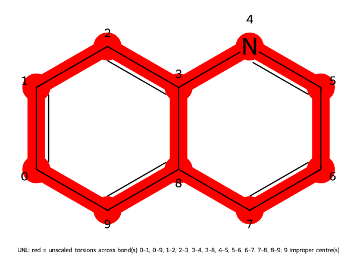

# REST2 (0.5.4): Chinolin in explicit water, 10 ns per state

The same four-state ladder as [REST2 (0.5.4): paracetamol](paracetamol.md), for Chinolin (quinoline,
C₉H₇N). Read that page first; this one repeats only what differs. Run with md-tools **0.5.4**
(commit `e1a84e1`) on four GPUs -- three RTX 3080 and one RTX A5000 -- with CUDA, mixed precision;
every number is copied from that run.

**Chinolin is here because it is rigid**, and the scaler shows it before anything runs.

## Commands

The inputs are the paracetamol ones with one line changed. `chinolin.smi`:

```text
c1ccc2ncccc2c1 chinolin
```

and, unchanged, `build-top.config` (`solute: {kind: ligand}`), `scaler.config` (REST2, 4 states,
τ 0 → 0.5) and `REST2.config` (5000 exchanges every 1000 steps, 10 ns per state).

```bash
mkdir -p CHINOLIN/build && cd CHINOLIN/build
md-openmm build-top -i chinolin.smi -os built.xml -op built.pdb -log built.log --config build-top.config
md-openmm build-top --rest2-scaler -s built.xml -p built.pdb --config scaler.config
cd ..
md-openmm build-md -odir ./REST2-run1 --config REST2.config
cd REST2-run1
CUDA_VISIBLE_DEVICES=5,6,7,8 ./run.sh
```

1806 atoms (17 solute, 595 waters, 2 Na⁺, 2 Cl⁻). Build 12 s, scaling 1 s, equilibration and
ladder 10 min.

## What the scaler says

```text
  unscaled torsions           amide omega 0 bond(s), aromatic ring 11 bond(s), double bond 0 bond(s), impropers 27 term(s)
                              67 torsion term(s) unscaled, 0 scaled
```



**Every torsion of quinoline is unscaled.** Its eleven ring bonds carry all its proper torsions, and
the rest are impropers. So this ladder scales only the nonbonded interactions — within the molecule
by (1−τ)², with the water by (1−τ) — and nothing about its shape. For a rigid molecule that is the
right answer: there is no conformational barrier to lower, and heating ring torsions would only let
the hot states buckle a ring the physical state keeps flat.

## Results

```text
# steps completed       : 5000000 of 5000000
# production per replica: 10000.0 ps
# NEIGHBOURING-PAIR acceptance:
#   state 0 <-> state 1   1186/2500   0.474
#   state 1 <-> state 2   1199/2500   0.480
#   state 2 <-> state 3   1200/2500   0.480
#   overall               3585/7500   0.478
#   solute region         17 atom(s), 11 unscaled central bond(s), impropers unscaled
# TIMINGS:
#   throughput            1499.07 ns/day per replica, 5996.30 ns/day aggregate over 4 state(s)
run_status: completed
```

* **Acceptance is about twice paracetamol's** (48 % against 22 %): with no torsion scaled, the
  states differ less from one another.
* **Round trips** from state 0 to state 3 and back, per walker: 142, 144, 152 and 144.
* **The ring stays flat in every state.** The ring torsion 0-1-2-3 has circular mean 0.1° and
  circular sd 6.4° at τ = 0, and 0.1° and 6.5° at τ = 0.5.

A REST2 ladder over a rigid molecule is a legitimate run and a quick one; what it cannot do is
sample conformations the molecule does not have. For a molecule with rotatable bonds, see how the
18 scaled terms of [paracetamol](paracetamol.md) behave instead.
