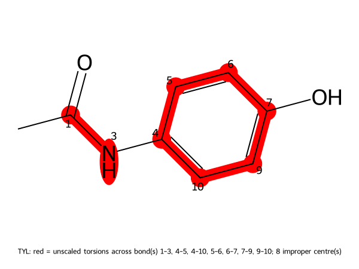
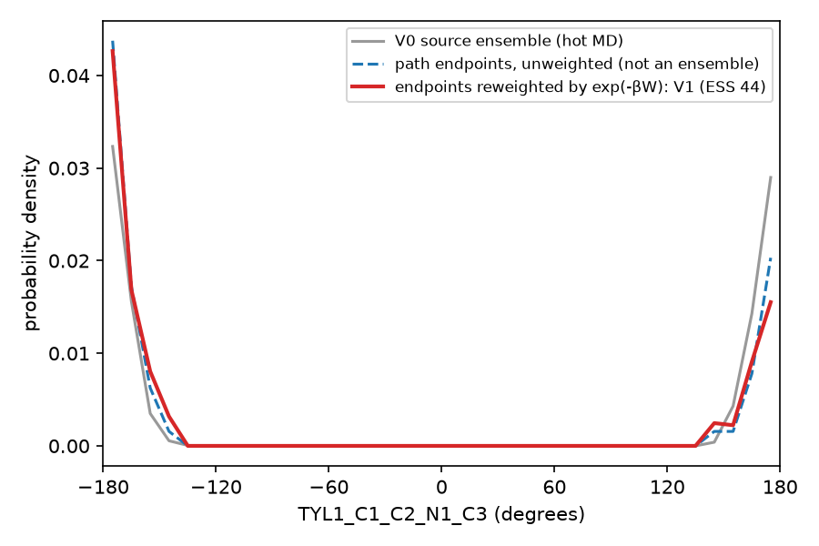
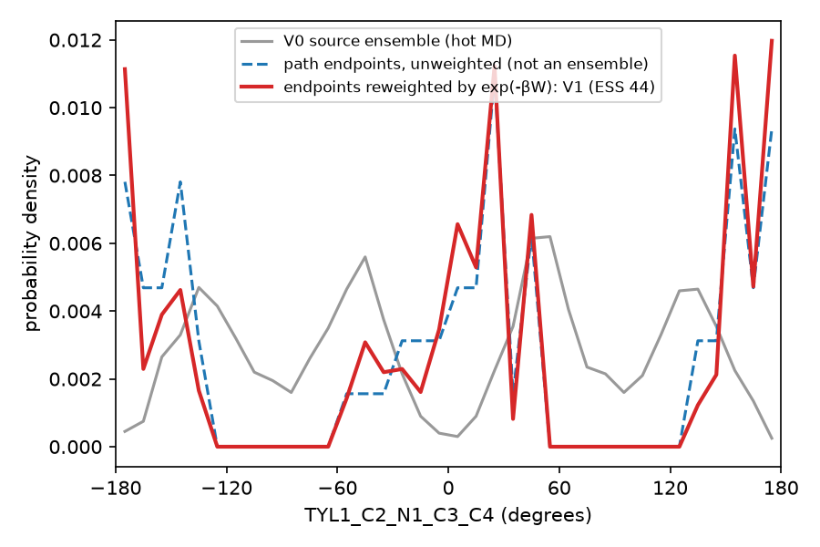

# AIS: paracetamol in explicit water

!!! note "Requires md-tools 0.5.4 or later"
    In 0.5.3, AIS switched a scaling coordinate τ inside one System. In 0.5.4 it is a linear
    transformation between **two** Systems, and the older behaviour is retired.

The AIS chain of [AIS: alanine dipeptide](alanine.md), applied to a small molecule given as SMILES.
Read that page first: it explains each step, and this page shows only where the ligand route differs
and what the run produced. Every command below was run exactly as written, and every number is
copied from the files that run produced. The run used md-tools at commit `3da35d0` on one NVIDIA RTX
3080, with CUDA and mixed precision.

It took about 13 minutes. Building took 1.5 min, most of it the partial-charge calculation, scaling
took 1 s, and the chain from minimisation to the last switching path took 11 min 34 s.

## 1. The system, with a residue name

```bash
mkdir -p PARA/build
cd PARA                                           # commands run from the dataset root
```

`build/paracetamol.smi`:

```text
CC(=O)Nc1ccc(O)cc1 paracetamol
```

`build/build-top.config`:

```yaml
solute:
  kind: ligand
  residue_name: TYL
solvent:
  model: TIP3P
  padding_nm: 1.5
hydrogen_mass_repartitioning:
  enabled: true
```

```bash
md-openmm build-top -i build/paracetamol.smi \
    -os build/built.xml -op build/built.pdb -log build/built.log --config build/build-top.config
```

`solute.residue_name` names the molecule's residue in `built.pdb`, and the bond-order file is named
after it, `TYL.sdf`, so the scaler finds the SDF by the residue it describes. Without a name the
residue is `UNL` and the file `built.sdf`. From `build/built.log`:

```text
Input interpretation
--------------------
  interpreted as              single-molecule SMILES
  smiles                      CC(=O)Nc1ccc(O)cc1
  residue name                TYL   (stated)
  small-molecule FF           sage-2.2.1

Validation
----------
  particle agreement          1800 atoms == 1800 particles  OK
  solute residue              TYL  OK
  HMR                         applied, target 3.024 amu, recommend 4.0 fs

Counts
------
  atoms                       1800
  residues                    597
  solute atoms                20
  waters                      592
  ions                        {'NA': 2, 'CL': 2}
  forcefield                  openff-2.2.1

Outputs
-------
  built.xml                   build/built.xml
  built.pdb                   build/built.pdb
  built.solute.pdb            build/built.solute.pdb
  TYL.sdf                     build/TYL.sdf
```

**Keep `TYL.sdf`.** It holds the bond orders, which is how the next step knows which bonds are
aromatic and which C–N is an amide.

## 2. Build V0

`build/scaler.config` is the same file as for alanine dipeptide:

```yaml
method: AIS
schedule:
  kind: linear
  n_states: 1
  tau_min: 0.5
  tau_max: 0.5
```

```bash
md-openmm build-top --rest2-scaler -s build/built.xml -p build/built.pdb --config build/scaler.config
```

From `build/AIS/scaler.log`:

```text
  solute                      20 atom(s)
  unscaled torsions           amide omega 1 bond(s), aromatic ring 6 bond(s), double bond 0 bond(s), impropers 24 term(s)
                              56 torsion term(s) unscaled, 18 scaled
  SDF for TYL                 TYL.sdf
  picture of TYL              TYL-unscaled.png  (TYL: red = unscaled torsions across bond(s) 1-3, 4-5, 4-10, 5-6, 6-7, 7-9, 9-10; 8 improper centre(s))
```



The amide (1–3) and the whole ring keep their full strength in V0. The hot state heats the other 18
torsion terms: the methyl rotation, the rotation of the ring about the N–C bond, and the O–H rotation.

## 3. Configuration and run

`AIS.config` is **identical** to the alanine dipeptide's, apart from a comment (see
[step 3 there](alanine.md#3-one-configuration-for-the-whole-chain)). `build-md` never names the
molecule. It reads the solute from `build/`.

```bash
md-openmm build-md -odir ./AIS-run1 --config AIS.config
cd AIS-run1
CUDA_DEVICE_ORDER=PCI_BUS_ID CUDA_VISIBLE_DEVICES=1 ./run.sh
```

| stage | what | wall time |
|---|---|---|
| `min` | 1000 iterations, unscaled System | 2.1 s |
| `eq_1`, `eq_2`, `eq_3` | 100 ps each on V0 | 11.1, 11.6, 10.8 s |
| `source` | 2 ns on V0, 1101 ns/day | 152.1 s |
| `AIS` | 64 paths × 20 ps | 468.2 s |

The generated torsion list has 40 entries, named `TYL1_<atom>_<atom>_<atom>_<atom>`. From `AIS.log`:

```text
  mixed forces                NonbondedForce, PeriodicTorsionForce
  shared forces               3 identical in both, added once
  ...
  source ensemble             V0, CONFIRMED: whole_prod1.nc records the System digest 7cf85d3024395307..., which is -s
```

and from `AIS.out`:

```text
    path   frame   obs  frames      W kJ/mol     reduced
  ----- ------- ----- ------- ------------- -----------
       0       5    21      21     -228.4085    -91.5708
       1       6    21      21     -226.5508    -90.8260
       2       7    21      21     -225.3365    -90.3392
```

As for alanine dipeptide, `evenly_spaced` used source frames 5 to 68 (see
[the note there](alanine.md#what-the-ais-log-checks-before-it-switches-anything)).

## 4. Reweight the torsions

With the same [`ais_reweight.py`](ais_reweight.py), for three torsions: the amide
`TYL1_C1_C2_N1_C3` (unscaled), the ring about N–C `TYL1_C2_N1_C3_C4` (scaled), and the O–H rotation
`TYL1_C5_C6_O2_H7` (scaled):

```bash
python ais_reweight.py AIS-run1 TYL1_C2_N1_C3_C4 TYL1_C1_C2_N1_C3 TYL1_C5_C6_O2_H7
```

```text
paths                    64
work  mean / min / max   -226.69 / -229.94 / -222.54 kJ/mol
dF (Jarzynski, V0 -> V1) -227.28 kJ/mol  (-91.12 kT)
Kish effective samples   44.4 of 64
```

The work values span 7.4 kJ/mol, about 3 kT, narrower than for alanine dipeptide, so more of the
paths count: 44 effective samples.

**The amide, unscaled, looks the same in every curve.** This is the expected result. V0 and V1 share
this torsion's potential, so switching has nothing to change:



`TYL1_C1_C2_N1_C3` is within 90° of trans in all 2001 source rows and in all 64 endpoints.

**The ring rotation, scaled, shows the limit of 64 paths.**



The grey source ensemble on V0 is smooth: 2001 rows over 2 ns, with four symmetric populations,
because the ring's two faces are equivalent. The red estimate of V1 rests on 44 effective endpoints
spread over 36 bins, and most of its spikes are single paths. It cannot show whether V1's
distribution differs from V0's for this torsion. For that, run more paths (`NPROC=4 ./run.sh` splits
them over four GPUs), or histogram with fewer bins (`--bins 12`).

**dF = −227.3 kJ/mol** is F(V1) − F(V0), as for alanine dipeptide: a check of the method, not a
property of paracetamol.

## Next

* the peptide route, with every step explained: [AIS: alanine dipeptide](alanine.md)
* REST2 on the same molecule: [REST2: paracetamol](../REST2/paracetamol.md)
* the method, the work convention and every file: [AIS](../../openmm_methods/AIS/README.md)
