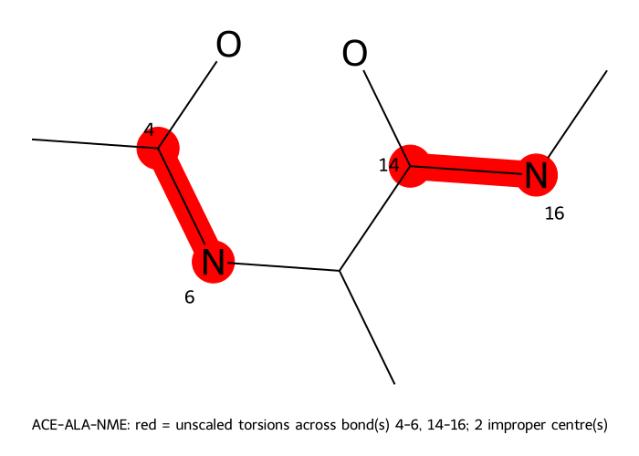
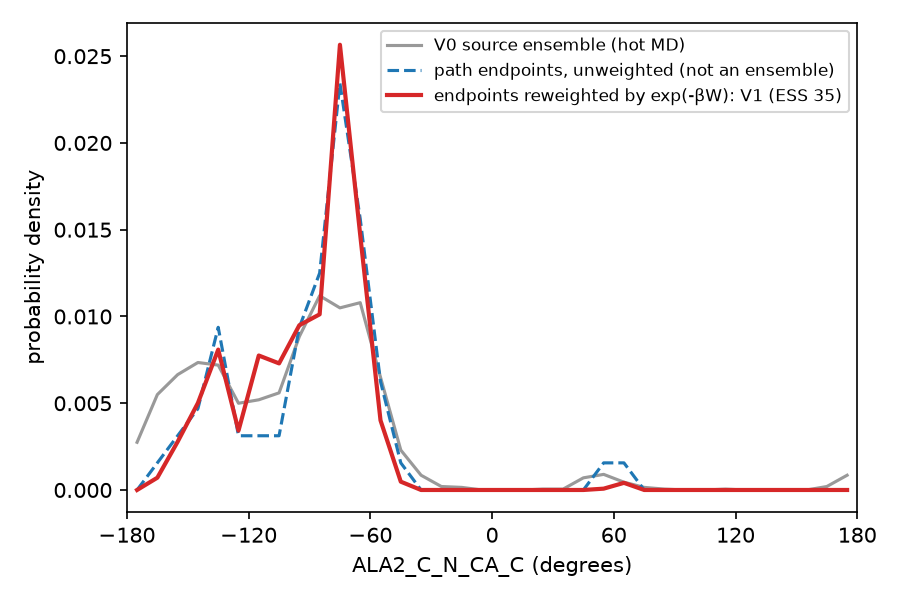
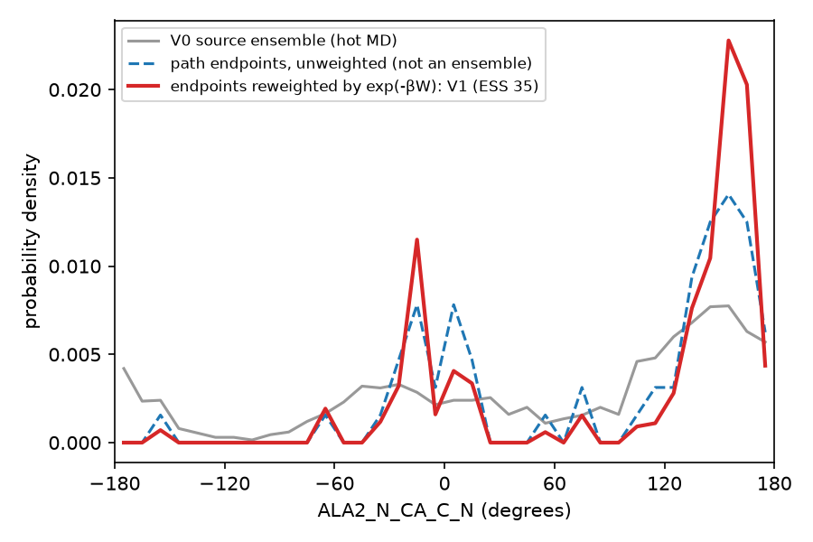

# AIS: alanine dipeptide in explicit water

**Tested against md-tools `0.5.4`.** Every command and every number on this page comes from a
run executed as written, at that version. It has not been re-run for 0.6.1.

!!! note "Requires md-tools 0.5.4 or later"
    In 0.5.3, AIS switched a scaling coordinate τ inside one System. In 0.5.4 it is a linear
    transformation between **two** Systems, and the older behaviour is retired.

Annealed importance sampling (AIS) for alanine dipeptide (ACE-ALA-NME), starting from the sequence
and ending with a reweighted φ/ψ distribution, with md-tools **0.5.4**. Every command below was run
exactly as written, and every number is copied from the files that run produced. The run used
md-tools at commit `3da35d0` on one NVIDIA RTX 3080, with CUDA and mixed precision. The picture in
step 2 came from commit `fb99d6e`, which draws peptides. Build the same scaled state without that
commit and you get the same state file, only without the picture.

The whole thing took about 12 minutes. Building took 3 s and scaling 1 s. The chain from
minimisation to the last switching path took 11 min 33 s.

## What AIS does here

There are two end states with the same atoms and different parameters:

* **V0** is the solute with its interactions scaled down (REST2 scaling at τ = 0.5), so its torsion
  barriers are lower and it moves more.
* **V1** is the ordinary, physical System.

md-tools first runs ordinary MD on V0, called the **source ensemble**. It then starts many short
**switching paths** from frames of that ensemble. Along each path the potential is

```text
V(λ) = (1 − λ)·V0 + λ·V1,        λ: 0 → 1
```

λ moves in small steps at frozen coordinates, and dynamics runs between steps. Each λ step adds
work, `ΔW = Δλ·(V1 − V0)(x)`. A path ends as a configuration of V1, but it is **not** a sample of
V1, because the switch was too fast for the system to relax. Give each endpoint the weight
`exp(−βW)` and the endpoints together estimate V1's equilibrium distribution (Jarzynski; Neal's
annealed importance sampling). Step 6 does exactly that.

The hot state keeps two things at full strength. **Amide ω torsions** stay unscaled, so the ensemble
never visits a cis peptide bond that V1 would almost never sample. **Impropers** stay unscaled too.
The scaler decides this when it builds V0 (see [REST2](../../openmm_methods/REST2/README.md)). AIS
itself only interpolates between two files. See [AIS](../../openmm_methods/AIS/README.md).

## 1. The dataset root and the system

```bash
mkdir -p ALA/build
cd ALA/build
```

`ALA.seq` gives the peptide as residue names, in order:

```text
ACE ALA NME
```

`build-top.config`:

```yaml
solute:
  kind: peptide
solvent:
  model: TIP3P
  padding_nm: 1.5
hydrogen_mass_repartitioning:
  enabled: true
```

```bash
md-openmm build-top -i ALA.seq \
    -os built.xml -op built.pdb -log built.log --config build-top.config
cd ..                                             # ALA/
```

tleap builds the capped peptide from the sequence, and build-top solvates it. From `built.log`:

```text
  HMR                         applied, target 3.024 amu, recommend 4.0 fs

Counts
------
  atoms                       1796
  residues                    597
  solute atoms                22
  waters                      590
  ions                        {'NA': 2, 'CL': 2}
  forcefield                  amber14-all.xml
```

The box is a rhombic dodecahedron of 19.1 nm³. Hydrogen mass repartitioning lets every later stage
run at 4 fs. `timestep_fs: auto` reads that from the masses in the System, not from the configuration.

## 2. Build V0, the scaled state

V1 is `build/built.xml`, which already exists. V0 is a scaled copy of it, built once and saved as a
file. `build/scaler.config` describes one state, at τ = 0.5:

```yaml
method: AIS
schedule:
  kind: linear
  n_states: 1
  tau_min: 0.5
  tau_max: 0.5
```

```bash
md-openmm build-top --rest2-scaler -s build/built.xml -p build/built.pdb --config build/scaler.config
```

It writes `build/AIS/`:

```text
build/AIS/
├── system_state0.xml      V0
├── scaler.yaml            what V0 is and how it was made (sha256 of every file)
├── scaler.log             the same, for a person
└── protein-unscaled.png   what stays unscaled, drawn
```

From `scaler.log`:

```text
  schedule                    linear, 1 state(s), tau 0.5 .. 0.5
  state 0 is at tau = 0.5: it is NOT the physical Hamiltonian. REST2 recovers the physical ensemble only from an unscaled state, so no state here samples it.
  solute                      22 atom(s)
  unscaled torsions           amide omega 2 bond(s), aromatic ring 0 bond(s), double bond 0 bond(s), impropers 2 term(s)
                              14 torsion term(s) unscaled, 28 scaled
  picture of protein          protein-unscaled.png  (ACE-ALA-NME: red = unscaled torsions across bond(s) 4-6, 14-16; 2 improper centre(s))
```

The warning is correct, and for AIS it is intended: V0 is not meant to be physical. The switching
paths are what bring the sample back to V1.

`protein-unscaled.png` marks in red both amide C–N bonds, ACE–ALA (4–6) and ALA–NME (14–16). Every
torsion about those bonds keeps its full strength in V0. The numbers are atom indices.



The heated torsions are the other 28 terms, including φ and ψ, which are what this tutorial measures.

## 3. One configuration for the whole chain

`AIS.config` at the dataset root:

```yaml
protocol: AIS
solvent: explicit

dynamics:
  tau: 0.5                       # a claim about build/AIS/, checked against scaler.yaml
  timestep_fs: auto              # 4 fs, because the System's masses show HMR
  temperature_K: 300.0
  seed: 20260917

stages:                          # the source chain, all on V0 except minimisation
  minimization_iterations: 1000
  restrained_nvt_steps: 25000    # 100 ps
  restrained_npt_steps: 25000    # 100 ps (run at fixed volume: see below)
  unrestrained_npt_steps: 25000  # 100 ps (run at fixed volume)
  production_steps: 500000       # 2 ns of hot MD: the source ensemble

reporting:
  crd_printout_solute: 250
  crd_printout_whole: 5000       # a whole-system frame every 20 ps: 100 source frames
  info_printout: 250
  checkpoint_printout: 2500

ais:
  number_of_paths: 64
  switching_steps: 5000          # 20 ps per path
  observation_interval_steps: 250
  parameter_update_interval_steps: 1

ais_source:
  generate: true                 # run the source ensemble in this chain
  first_frame: 5                 # skip the first 100 ps of it
  selection: evenly_spaced

collective_variables:
  generate: all_solute_torsions  # write cv.yaml naming every solute torsion
  interval_steps: 250
```

Three parts do what earlier releases left to you:

* **`ais_source.generate: true`** runs the source ensemble in the same `run.sh`, before the switching
  paths start. The paths read that run's whole-system trajectory, `whole_prod1.nc`.
* **`collective_variables.generate: all_solute_torsions`** has `build-md` write the CV file itself.
  It lists every proper torsion of the solute by explicit atom selector, 41 of them here. The result
  is an ordinary `cv.yaml`: copy it, delete lines and name the copy in `collective_variables.file`
  if you want fewer.
* **`dynamics.tau: 0.5`** scales nothing. It is a claim about `build/AIS/system_state0.xml`, and
  every hot stage refuses if the scaler record disagrees with it. A scaled run is fixed-volume
  throughout, so the two "NPT" equilibration stages run as NVT and are named that way.

```bash
md-openmm build-md -odir ./AIS-run1 --config AIS.config
```

From `AIS-run1/build-md.log`:

```text
Stages
------
  min                         1000 iterations
  eq_nvt_posres               25000 steps, NVT
  eq_nvt_posres_2             25000 steps, NVT
  eq_nvt_free                 25000 steps, NVT
  source                      500000 steps, NVT

AIS
---
  paths                       64
  lambda                      0 -> 1: V0 (-s/-p) -> V1 (-s2/-p2), linear
  switching                   5000 steps
  observations                21 (both endpoints included)
  source                      whole_prod1.nc
```

The generated `run.sh` **minimises the unscaled System**. `min/` sits beside `build/` and is shared
by every method run on this system, so it never depends on one method's scaled state. Every later
stage runs on V0:

```text
SCALED_SYSTEM="${HERE}/../build/AIS/system_state0.xml"

echo "== min =="
md-openmm md-run -i ../input/min.in \
  -p "${TOPOLOGY}" -s "${SYSTEM}" \
  -odir ../min "$@"

echo "== eq_1 =="
md-openmm md-run -i ../input/eq_1.in \
  -p "${TOPOLOGY}" -s "${SCALED_SYSTEM}" \
  -c ../min/min.xml \
  -odir eq "$@"
...
echo "== source =="
md-openmm md-run -i ../input/source.in \
  -p "${TOPOLOGY}" -s "${SCALED_SYSTEM}" \
  -c eq/eq_3.xml \
  -odir . "$@"
...
echo "== AIS =="
"${LAUNCH[@]}" md-openmm md-run -i ../input/AIS.in \
  -p "${TOPOLOGY}" -s "${SCALED_SYSTEM}" -p2 "${TOPOLOGY}" -s2 "${SYSTEM}" \
  -o AIS.out -log AIS.log "$@"
```

The AIS call names both end states: `-s`/`-p` is V0, and `-s2`/`-p2` is V1.

## 4. Run it

```bash
cd AIS-run1
CUDA_DEVICE_ORDER=PCI_BUS_ID CUDA_VISIBLE_DEVICES=0 ./run.sh
```

| stage | what | wall time |
|---|---|---|
| `min` | 1000 iterations, unscaled System | 2.3 s |
| `eq_1`, `eq_2`, `eq_3` | 100 ps each on V0 | 11.3, 12.0, 12.4 s |
| `source` | 2 ns on V0, 1079 ns/day | 154.1 s |
| `AIS` | 64 paths × 20 ps | 464.7 s |

It ended with `run.sh: all stages reported completion`. The paths are independent, so
`NPROC=4 ./run.sh` with four GPUs splits them four ways. Path *n* writes the same files whatever the
worker count.

### What the AIS log checks before it switches anything

From `AIS.log`:

```text
End states
----------
  V0                          .../build/AIS/system_state0.xml  (.../build/built.pdb)  -- the source ensemble's state
  V1                          .../build/built.xml  (.../build/built.pdb)
  mixed forces                NonbondedForce, PeriodicTorsionForce
  shared forces               3 identical in both, added once

Path
----
  lambda                      0 -> 1 (linear): V(lambda) = (1 - lambda) V0 + lambda V1
  switching                   5000 steps = 20 ps at 4.0 fs
  parameter updates           5000 (every 1 step)
  observations                21 (work, every 250 steps, both endpoints included)
  ensemble                    fixed volume; no barostat

Source ensemble
---------------
  trajectory                  whole_prod1.nc  (NETCDF)
  frames                      100 total, 95 eligible (frames 5..99 inclusive)
  selection                   evenly_spaced
  source ensemble             V0, CONFIRMED: whole_prod1.nc records the System digest 88a032553a0afca1..., which is -s
  velocities                  not read from the source; each path draws fresh Maxwell-Boltzmann momenta at 300.0 K with its own recorded seed
```

* **mixed / shared forces.** Only the forces that differ between V0 and V1 are interpolated. Bonds,
  angles and the motion remover are identical in both files, so they are added once. md-tools refuses
  two Systems that differ in atoms, masses, constraints, box, barostat or force layout.
* **CONFIRMED.** The source stage wrote the sha256 of the System it integrated into
  `whole_prod1.nc`, and it matches `system_state0.xml` (the digest `scaler.yaml` records). The paths
  therefore start from an ensemble of exactly the V0 they switch from. A source trajectory from
  somewhere else, with no digest, reads *asserted* instead.

!!! warning "Which frames were used"
    `evenly_spaced` divides the 95 eligible frames by the 64 paths and rounds down, giving a stride
    of 1. The paths therefore started from frames 5 to 68 (see `selected_source_frames.csv`), and
    frames 69 to 99 went unused. Frames are 20 ps apart, so neighbouring paths still start from
    different configurations. If you want the whole window covered, ask for a path count that
    divides it, or use `selection: uniform_random`.

## 5. The output

```text
AIS-run1/
├── whole_prod1.nc, solute_prod1.nc   the source ensemble (V0)
├── source.cv.csv                     all 41 torsions over the source run, every 250 steps: 2001 rows
├── AIS_paths.csv                     one row per path: total work
├── AIS_work.csv                      one row per observation: λ before/after, ΔW, V0 and V1 potentials
├── AIS_cv.csv                        all 41 torsions, per path, per observation: 64 × 21 rows
├── AIS_traj0000.nc ... 0063.nc       each path's frames
└── cv.7b88827513ab.yaml              the generated torsion list, content-addressed
```

`AIS_work.csv` also allows a check without trusting md-tools. `potential_direct_kj_mol` is V(λ) at
the saved frame, so it must equal `(1 − λ)·potential_v0_kj_mol + λ·potential_v1_kj_mol`. At
observation 0, λ = 0, and on path 0 both sides are `-24835.858…`. A work row sums all 250 λ steps
since the previous observation, each taken at the coordinates of its own step. It is therefore not
`Δλ × (V1 − V0)` of the saved frame.

From `AIS.out`, the first rows of the path table:

```text
    path   frame   obs  frames      W kJ/mol     reduced
  ----- ------- ----- ------- ------------- -----------
       0       5    21      21     -133.9089    -53.6851
       1       6    21      21     -131.6082    -52.7628
       2       7    21      21     -133.5538    -53.5428
```

## 6. Reweight the torsions

The estimator is analysis, so it is not part of md-tools. Download
[`ais_reweight.py`](../shared/ais_reweight.py) and run it in the run directory's parent. Its core fits in a few
lines:

```python
reduced = paths["total_reduced_work"]                         # βW per path
w = np.exp(-(reduced - reduced.min()))
w /= w.sum()                                                  # exp(−βW), normalised
ess = 1 / np.sum(w**2)                                        # Kish effective sample size
ends = cv[cv.protocol_step == cv.protocol_step.max()]         # each path's last row, λ = 1
np.histogram(ends[name], bins=edges, weights=w, density=True)
```

φ is `ALA2_C_N_CA_C` and ψ is `ALA2_N_CA_C_N`, as named in the generated `cv.yaml`:

```bash
python ais_reweight.py AIS-run1 ALA2_C_N_CA_C ALA2_N_CA_C_N
```

```text
paths                    64
work  mean / min / max   -134.79 / -139.27 / -128.17 kJ/mol
dF (Jarzynski, V0 -> V1) -135.70 kJ/mol  (-54.40 kT)
Kish effective samples   34.9 of 64
wrote AIS-run1/reweighted_ALA2_C_N_CA_C.png
wrote AIS-run1/reweighted_ALA2_N_CA_C_N.png
```





How to read them:

* **Grey is V0**, the hot ensemble the paths started from. It is broad, because φ and ψ were heated.
* **Blue dashed** is the endpoints with no weights. It is not an ensemble of anything. It shows where
  20 ps of switching left the paths.
* **Red** is the endpoints weighted by `exp(−βW)`, which estimates V1, the physical dipeptide. φ
  narrows onto the region around −75°, and ψ concentrates in the β/polyproline band near 150°.
* **ESS 34.9 of 64.** The work values span 11 kJ/mol, about 4.4 kT, so a few paths do not dominate
  the weights. The narrower the work distribution, the closer this number stays to the path count.
  If it drops below about a tenth of the paths, switch more slowly or run more paths.
* **dF = −135.7 kJ/mol** is F(V1) − F(V0), the free energy of restoring the solute's interactions
  to full strength. It checks the method, but it is not a physical observable of the peptide.

64 endpoints spread over 36 bins make a jagged histogram, and the red curve carries only 35 effective
samples. The shape is informative. The height of any single bin is not.

**The amide stays trans throughout.** The torsion `ACE1_CH3_C_N_CA`, the ACE–ALA ω, is within 90° of
trans in all 2001 source rows and in all 64 endpoints. So is `ALA2_CA_C_N_C` (ALA–NME). This is the
unscaled amide from step 2 doing its job.

## Next

* the same chain for a small molecule: [AIS: paracetamol](../paracetamol/AIS.md)
* the method, the work convention and every file: [AIS](../../openmm_methods/AIS/README.md)
