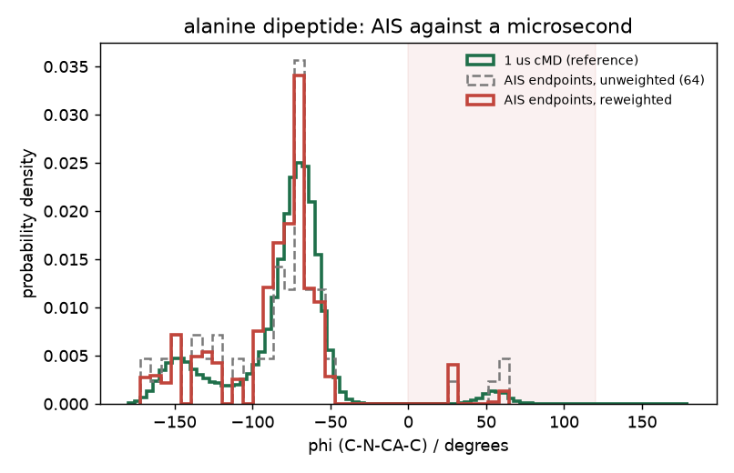

# AIS: alanine dipeptide in explicit water

**Tested against md-tools `0.6.1`.** Every command and every number on this page comes from a
run executed as written, at that version.

Annealed importance sampling (AIS) for alanine dipeptide (ACE-ALA-NME), starting from the sequence
and ending with a reweighted φ/ψ distribution. Every command below was run exactly as written on
one NVIDIA RTX 3080, with CUDA and mixed precision, and every number is copied from the files that
run produced.

The whole thing took about 10 minutes. Building took 3 s and scaling 1 s. The chain from
minimisation to the last switching path took 9 min 44 s.

## What AIS does here

There are two end states with the same atoms and different parameters:

* **V0** is the solute with its interactions scaled down (REST2 scaling at τ = 0.5), so its torsion
  barriers are lower and it moves more.
* **V1** is the ordinary, physical System.

md-tools first runs ordinary MD on V0, called the **source ensemble**. It then starts many short
**switching paths** from frames of that ensemble. Along each path the potential is

```text
V(λ) = (1 − λ)·V0 + λ·V1,        λ: 0 → 1
```

λ moves in small steps at frozen coordinates, and dynamics runs between steps. Each λ step adds
work, `ΔW = Δλ·(V1 − V0)(x)`. A path ends as a configuration of V1, but it is **not** a sample of
V1, because the switch was too fast for the system to relax. Give each endpoint the weight
`exp(−βW)` and the endpoints together estimate V1's equilibrium distribution (Jarzynski; Neal's
annealed importance sampling). Step 6 does exactly that.

The hot state keeps two things at full strength. **Amide ω torsions** stay unscaled, so the ensemble
never visits a cis peptide bond that V1 would almost never sample. **Impropers** stay unscaled too.
The scaler decides this when it builds V0 (see [REST2](../../openmm_methods/REST2/README.md)). AIS
itself only interpolates between two files. See [AIS](../../openmm_methods/AIS/README.md).

## 1. The dataset root and the system

```bash
mkdir -p ALA/build
cd ALA/build
```

`ALA.seq` gives the peptide as residue names, in order:

```text
ACE ALA NME
```

`build-top.config`:

```yaml
solute:
  kind: peptide
solvent:
  model: TIP3P
  padding_nm: 1.5
hydrogen_mass_repartitioning:
  enabled: true
```

```bash
md-openmm build-top -i ALA.seq \
    -os built.xml -op built.pdb -log built.log --config build-top.config
cd ..                                             # ALA/
```

tleap builds the capped peptide from the sequence, and build-top solvates it. From `built.log`:

```text
  HMR                         applied, target 3.024 amu, recommend 4.0 fs

Counts
------
  atoms                       1796
  residues                    597
  solute atoms                22
  waters                      590
  ions                        {'NA': 2, 'CL': 2}
  forcefield                  amber14-all.xml
```

The box is a rhombic dodecahedron of 19.1 nm³. Hydrogen mass repartitioning lets every later stage
run at 4 fs. `timestep_fs: auto` reads that from the masses in the System, not from the configuration.

## 2. Build the two end states

Both end states are saved as files, written once by one scaler run.
`build/scaler.config` names the two taus:

```yaml
method: AIS
schedule:
  kind: linear
  n_states: 2
  tau_min: 0.0
  tau_max: 0.5
```

```bash
md-openmm build-top --rest2-scaler -s build/built.xml -p build/built.pdb --config build/scaler.config
```

It writes `build/AIS/`:

```text
build/AIS/
├── system_state0.xml      tau 0    -- V1, the physical end state
├── system_state1.xml      tau 0.5  -- V0, what the source ensemble samples
├── scaler.yaml            what each state is and how it was made (sha256 of every file)
├── scaler.log             the same, for a person
└── protein-unscaled.png   what stays unscaled, drawn
```

From `scaler.log`:

```text
  schedule                    linear, 2 state(s), tau 0.0 .. 0.5
  solute                      22 atom(s)
  unscaled torsions           amide omega 2 bond(s), aromatic ring 0 bond(s), double bond 0 bond(s), impropers 2 term(s)
                              14 torsion term(s) unscaled, 28 scaled
  picture of protein          protein-unscaled.png  (ACE-ALA-NME: red = unscaled torsions across bond(s) 4-6, 14-16; 2 improper centre(s))

States
------
  system_state0.xml      tau 0.0       (1-tau)^2 1.000000   1-tau 1.000000
  system_state1.xml      tau 0.5       (1-tau)^2 0.250000   1-tau 0.500000
```

!!! note "The state index follows τ; the V-number follows λ. They run opposite ways."
    `system_state<i>` ascends with τ in **every** method, so state 0 is the τ = 0 Hamiltonian here
    exactly as it is in a REST2 ladder, and `scaler.yaml` records `state0_is_physical: true`
    rather than leaving it to be read off a filename.

    `V0` and `V1` are the **λ endpoints**, not τ values: λ runs 0 → 1 from V0 to V1, and V0 is
    whichever state the source ensemble was sampled from. For an anneal-to-physical switch that
    is the scaled one, so:

    | | λ | τ | file |
    |---|---|---|---|
    | **V0** — source, scaled | 0 | 0.5 | `system_state1.xml` |
    | **V1** — physical | 1 | 0 | `system_state0.xml` |

    The digits invert, and that is not an accident to be tidied away: τ is a property of the
    files, λ is a property of the run. Before 0.6.1 AIS wrote only the scaled state, as
    `system_state0.xml`, which made state 0 unphysical for AIS and physical for REST2. An old
    tree must be rebuilt; `build-top --rest2-scaler` refuses the old `n_states: 1` schedule by
    name and says so.

Writing both end states from one scaler run also means `scaler.yaml` carries a digest for each,
instead of V1 being an unrecorded reference to `build/built.xml`.

`protein-unscaled.png` marks in red both amide C–N bonds, ACE–ALA (4–6) and ALA–NME (14–16). Every
torsion about those bonds keeps its full strength in V0. The numbers are atom indices.


The heated torsions are the other 28 terms, including φ and ψ, which are what this tutorial measures.

## 3. One configuration for the whole chain

`AIS.config` at the dataset root:

```yaml
protocol: AIS
solvent: explicit

dynamics:
  tau: 0.5                       # a claim about build/AIS/, checked against scaler.yaml
  timestep_fs: auto              # 4 fs, because the System's masses show HMR
  temperature_K: 300.0
  seed: 20260917

stages:                          # the source chain, all on V0 except minimisation
  minimization_iterations: 1000
  restrained_nvt_steps: 25000    # 100 ps
  restrained_npt_steps: 25000    # 100 ps (run at fixed volume: see below)
  unrestrained_npt_steps: 25000  # 100 ps (run at fixed volume)
  production_steps: 500000       # 2 ns of hot MD: the source ensemble

reporting:
  crd_printout_solute: 250
  crd_printout_whole: 5000       # a whole-system frame every 20 ps: 100 source frames
  info_printout: 250
  checkpoint_printout: 2500

ais:
  number_of_paths: 64
  switching_steps: 5000          # 20 ps per path
  observation_interval_steps: 250
  parameter_update_interval_steps: 1

ais_source:
  generate: true                 # run the source ensemble in this chain
  first_frame: 5                 # skip the first 100 ps of it
  selection: evenly_spaced

collective_variables:
  generate: all_solute_torsions  # write cv.yaml naming every solute torsion
  interval_steps: 250
```

Three parts do what earlier releases left to you:

* **`ais_source.generate: true`** runs the source ensemble in the same `run.sh`, before the switching
  paths start. The paths read that run's whole-system trajectory, `whole_prod1.nc`.
* **`collective_variables.generate: all_solute_torsions`** has `build-md` write the CV file itself.
  It lists every proper torsion of the solute by explicit atom selector, 41 of them here. The result
  is an ordinary `cv.yaml`: copy it, delete lines and name the copy in `collective_variables.file`
  if you want fewer.
* **`dynamics.tau: 0.5`** scales nothing. It is a claim about `build/AIS/system_state1.xml`, and
  every hot stage refuses if the scaler record disagrees with it. A scaled run is fixed-volume
  throughout, so the two "NPT" equilibration stages run as NVT and are named that way.

```bash
md-openmm build-md -odir ./AIS-run1 --config AIS.config
```

From `AIS-run1/build-md.log`:

```text
Stages
------
  min                         1000 iterations
  eq_nvt_posres               25000 steps, NVT
  eq_nvt_posres_2             25000 steps, NVT
  eq_nvt_free                 25000 steps, NVT
  source                      500000 steps, NVT

AIS
---
  paths                       64
  lambda                      0 -> 1: V0 (-s/-p) -> V1 (-s2/-p2), linear
  switching                   5000 steps
  observations                21 (both endpoints included)
  source                      whole_prod1.nc
```

The generated `run.sh` **minimises the unscaled System**. `min/` sits beside `build/` and is shared
by every method run on this system, so it never depends on one method's scaled state. Every later
stage runs on V0:

```text
SCALED_SYSTEM="${HERE}/../build/AIS/system_state1.xml"   # V0, tau 0.5
V1_STATE="${HERE}/../build/AIS/system_state0.xml"        # V1, tau 0

echo "== min =="
md-openmm md-run -i ../input/min.in \
  -p "${TOPOLOGY}" -s "${SYSTEM}" \
  -odir ../min "$@"

echo "== eq_1 =="
md-openmm md-run -i ../input/eq_1.in \
  -p "${TOPOLOGY}" -s "${SCALED_SYSTEM}" \
  -c ../min/min.xml \
  -odir eq "$@"
...
echo "== source =="
md-openmm md-run -i ../input/source.in \
  -p "${TOPOLOGY}" -s "${SCALED_SYSTEM}" \
  -c eq/eq_3.xml \
  -odir . "$@"
...
echo "== AIS =="
"${LAUNCH[@]}" md-openmm md-run -i ../input/AIS.in \
  -p "${TOPOLOGY}" -s "${SCALED_SYSTEM}" -p2 "${TOPOLOGY}" -s2 "${V1_STATE}" \
  -o AIS.out -log AIS.log "$@"
```

The AIS call names both end states: `-s`/`-p` is V0, and `-s2`/`-p2` is V1.

## 4. Run it

```bash
cd AIS-run1
CUDA_DEVICE_ORDER=PCI_BUS_ID CUDA_VISIBLE_DEVICES=0 ./run.sh
```

| stage | what | wall time |
|---|---|---|
| `min` | 1000 iterations, unscaled System | 0.9 s |
| `eq_1`, `eq_2`, `eq_3` | 100 ps each on V0 | 8.2, 8.1, 8.0 s |
| `source` | 2 ns on V0, 1241 ns/day | 139.4 s |
| `AIS` | 64 paths × 20 ps | 418.9 s |

It ended with `run.sh: all stages reported completion`. The paths are independent, so
`NPROC=4 ./run.sh` with four GPUs splits them four ways. Path *n* writes the same files whatever the
worker count.

### What the AIS log checks before it switches anything

From `AIS.log`:

```text
End states
----------
  V0                          .../build/AIS/system_state1.xml  (.../build/built.pdb)  -- the source ensemble's state
  V1                          .../build/built.xml  (.../build/built.pdb)
  mixed forces                NonbondedForce, PeriodicTorsionForce
  shared forces               3 identical in both, added once

Path
----
  lambda                      0 -> 1 (linear): V(lambda) = (1 - lambda) V0 + lambda V1
  switching                   5000 steps = 20 ps at 4.0 fs
  parameter updates           5000 (every 1 step)
  observations                21 (work, every 250 steps, both endpoints included)
  ensemble                    fixed volume; no barostat

Source ensemble
---------------
  trajectory                  whole_prod1.nc  (NETCDF)
  frames                      100 total, 95 eligible (frames 5..99 inclusive)
  selection                   evenly_spaced
  source ensemble             V0, CONFIRMED: whole_prod1.nc records the System digest 88a032553a0afca1..., which is -s
  velocities                  not read from the source; each path draws fresh Maxwell-Boltzmann momenta at 300.0 K with its own recorded seed
```

* **mixed / shared forces.** Only the forces that differ between V0 and V1 are interpolated. Bonds,
  angles and the motion remover are identical in both files, so they are added once. md-tools refuses
  two Systems that differ in atoms, masses, constraints, box, barostat or force layout.
* **CONFIRMED.** The source stage wrote the sha256 of the System it integrated into
  `whole_prod1.nc`, and it matches `system_state1.xml` (the digest `scaler.yaml` records). The paths
  therefore start from an ensemble of exactly the V0 they switch from. A source trajectory from
  somewhere else, with no digest, reads *asserted* instead.

!!! warning "Which frames were used"
    `evenly_spaced` divides the 95 eligible frames by the 64 paths and rounds down, giving a stride
    of 1. The paths therefore started from frames 5 to 68 (see `selected_source_frames.csv`), and
    frames 69 to 99 went unused. Frames are 20 ps apart, so neighbouring paths still start from
    different configurations. If you want the whole window covered, ask for a path count that
    divides it, or use `selection: uniform_random`.

## 5. The output

```text
AIS-run1/
├── whole_prod1.nc, solute_prod1.nc   the source ensemble (V0)
├── source.cv.csv                     all 41 torsions over the source run, every 250 steps: 2001 rows
├── AIS_paths.csv                     one row per path: total work
├── AIS_work.csv                      one row per observation: λ before/after, ΔW, V0 and V1 potentials
├── AIS_cv.csv                        all 41 torsions, per path, per observation: 64 × 21 rows
├── AIS_traj0000.nc ... 0063.nc       each path's frames
└── cv.7b88827513ab.yaml              the generated torsion list, content-addressed
```

`AIS_work.csv` also allows a check without trusting md-tools. `potential_direct_kj_mol` is V(λ) at
the saved frame, so it must equal `(1 − λ)·potential_v0_kj_mol + λ·potential_v1_kj_mol`. At
observation 0, λ = 0, and on path 0 both sides are `-24835.858…`. A work row sums all 250 λ steps
since the previous observation, each taken at the coordinates of its own step. It is therefore not
`Δλ × (V1 − V0)` of the saved frame.

From `AIS.out`, the first rows of the path table:

```text
    path   frame   obs  frames      W kJ/mol     reduced
  ----- ------- ----- ------- ------------- -----------
       0       5    21      21     -133.9089    -53.6851
       1       6    21      21     -131.6082    -52.7628
       2       7    21      21     -133.5538    -53.5428
```

## 6. Reweighting the torsions, against a microsecond

Each path ends as a configuration of V1 but is **not** a sample of V1 — the switch was too fast for
the system to relax. Weighting each endpoint by `exp(−βW)` recovers V1's equilibrium distribution
(Jarzynski). The question is whether it actually does, and on this system that can be checked
against a [1 µs unbiased run](cMD.md#4-what-10-ns-sampled-against-a-microsecond).



| | time in the αL basin |
|---|---|
| AIS endpoints, **unweighted** | 6.25% |
| AIS endpoints, **reweighted** | **3.59%** |
| 1 µs cMD — the reference | **2.76%** |

**The weights do their job.** The raw endpoints over-populate αL by more than a factor of two,
because they started from a hot ensemble in which that basin is cheap and 20 ps of switching does
not undo that. Reweighting moves the occupancy from 6.25% down to 3.59%, against a true 2.76% —
most of the way, in the right direction, without ever having been told the answer.

It does not land exactly, and the reason is the sample rather than the method: 64 paths put only a
handful of endpoints in that basin, so the occupancy carries roughly half its own value as
uncertainty. **3.59% and 2.76% are the same number at this sample size.** The shape of the curve
is informative; the height of any single bin is not.

| | |
|---|---|
| Kish effective samples | **37.7 of 64** |
| work spread | 10 kJ/mol, about 4.1 kT |
| ΔF (Jarzynski, V0 → V1) | −135.2 kJ/mol (−54.2 kT) |

ESS 37.7 of 64 means no small group of paths dominates the weights — the narrower the work
distribution, the closer that number stays to the path count, and if it drops below about a tenth
of the paths the estimate is resting on a few rare trajectories. (That is exactly what happens on
larger solutes: the [chignolin folding run](../chignolin/index.md) scales 138 atoms instead of 22
and returns an ESS near 1.)

ΔF is F(V1) − F(V0), the free energy of restoring the solute's interactions to full strength. It
checks the method; it is not a physical observable of the peptide.

**The amide stays trans throughout.** `ACE1_CH3_C_N_CA`, the ACE–ALA ω, is within 90° of trans in
all 2001 source rows and in all 64 endpoints, and so is `ALA2_CA_C_N_C`. That is the unscaled amide
from step 2 doing its job: a hot state that isomerised it would hand the switch a geometry the
physical state never visits.

## Next

* the same chain for a small molecule: [AIS: paracetamol](../paracetamol/AIS.md)
* the method, the work convention and every file: [AIS](../../openmm_methods/AIS/README.md)
