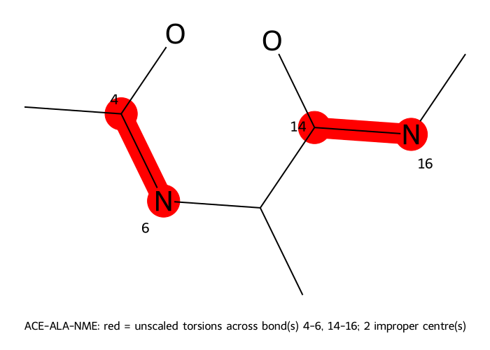

# REST2: alanine dipeptide, four states

**Tested against md-tools `0.6.1`.** Every command and every number on this page comes from a
run executed as written, at that version, on four NVIDIA RTX 3080 cards.

A four-state REST2 ladder over the smallest system in this set: 22 solute atoms, τ = 0, 0.167,
0.333, 0.5, 10 ns of production **per state**. The ladder took **6 min 14 s**.

**Starts from a built system.** Do [the system page](index.md) first.

This is the ladder to read first if you want to see what REST2 does without anything else going
on. Alanine dipeptide has exactly two interesting torsions, φ and ψ, and
[cMD](cMD.md) already crosses their barriers — so unlike chignolin or a protein–ligand complex,
you can check the ladder's answer against a plain run rather than having to trust it.

## What this runs

Four copies at 300 K, differing only in how strongly the solute interacts: state *i* scales
solute–solute terms by (1−τ)² and solute–water by (1−τ). State 0 is the real dipeptide, and
neighbours swap configurations every 2 ps. Both amide ω torsions and the impropers are never
scaled. The method: [REST2](../../openmm_methods/REST2/README.md).

## 1. Build the four scaled states

`build/scaler.config`:

```yaml
method: REST2
schedule: {kind: linear, n_states: 4, tau_min: 0.0, tau_max: 0.5}
```

```bash
md-openmm build-top --rest2-scaler -s build/built.xml -p build/built.pdb --config build/scaler.config
```

From `scaler.log`:

```text
  schedule                    linear, 4 state(s), tau 0.0 .. 0.5
  solute                      22 atom(s)
  unscaled torsions           amide omega 2 bond(s), aromatic ring 0 bond(s), double bond 0 bond(s), impropers 2 term(s)
                              14 torsion term(s) unscaled, 28 scaled
  picture of protein          protein-unscaled.png  (ACE-ALA-NME: red = unscaled torsions across bond(s) 4-6, 14-16; 2 improper centre(s))
```

Both amide C–N bonds — ACE–ALA (4–6) and ALA–NME (14–16) — keep every torsion across them at full
strength in every state. What REST2 heats are the other 28 terms, **including φ and ψ**, which are
the coordinates this system is about.



## 2. Generate the ladder

`REST2.config` at the dataset root:

```yaml
protocol: REST2
solvent: explicit

rest2:
  number_of_replicas: 4          # must match build/REST2/scaler.yaml
  tau_max: 0.5                   # must match build/REST2/scaler.yaml
  exchange_interval_steps: 500   # 2 ps between exchange attempts at 4 fs
  number_of_exchanges: 5000      # 2,500,000 steps = 10 ns per state
  equilibration_steps: 25000     # 100 ps per state at its own Hamiltonian

stages:
  minimization_iterations: 5000
  restrained_nvt_steps: 25000    # 100 ps
  restrained_npt_steps: 25000    # 100 ps
  unrestrained_npt_steps: 50000  # 200 ps

reporting:
  crd_printout_solute: 500       # a solute frame every 2 ps: 5000 frames per state
  crd_printout_whole: 25000
  info_printout: 2500
  checkpoint_printout: 25000
```

```bash
cd ..                                            # ALA/
md-openmm build-md -odir ./REST2-run1 --config REST2.config
```

`number_of_replicas` and `tau_max` scale nothing — they are a **claim** about `build/REST2/`, and
`build-md` refuses if they disagree with it.

## 3. Run it

Four replicas need four workers. Give each one its own GPU if you have them:

```bash
cd REST2-run1
CUDA_DEVICE_ORDER=PCI_BUS_ID CUDA_VISIBLE_DEVICES=1,2,3,4 ./run.sh
```

With fewer cards the workers share, which md-tools allows only under NVIDIA MPS and refuses
otherwise — [the paracetamol ladder](../paracetamol/REST2.md#5-run-it) describes that arrangement
in full, including why the pipe directory must be short and why the client then addresses the card
as device `0`.

## 4. Results

`remd_records/REST2_prod1.out`:

```text
# steps completed       : 2500000 of 2500000
# exchanges             : 5000 (every 500 steps = 2.0 ps)
# solute frames         : 5000 (every 500 steps)
# production per replica: 10000.0 ps
# final state->walker   : [2, 3, 0, 1]
# NEIGHBOURING-PAIR acceptance:
#   state 0 <-> state 1   656/2500   0.262
#   state 1 <-> state 2   638/2500   0.255
#   state 2 <-> state 3   616/2500   0.246
#   overall               1910/7500   0.255
# REST2:
#   tau ladder            0, 0.166667, 0.333333, 0.5   (4 state(s), one temperature 300.0 K, NVT)
#   solute region         22 atom(s), 2 unscaled central bond(s), impropers unscaled
#   velocities on swap    never rescaled (one beta across the ladder)
# TIMINGS:
#   elapsed               374.4 s
```

**Acceptance near 0.25 on every pair** and almost flat across the ladder — 0.262, 0.255, 0.246 —
which is what a well-spaced linear ladder looks like on a small solute. Compare
[paracetamol](../paracetamol/REST2.md) at 0.222 over the same τ span with 20 solute atoms, and
[chignolin](../chignolin/REST2.md), which needs six states to reach only τ = 0.3 with 138 atoms:
the number of rungs a τ span needs grows with the size of the heated region, and this is the
smallest region in the set.

`final state->walker` is `[2, 3, 0, 1]`: no walker ended where it started.

Each state has its own trajectory, `solute_state<i>_prod1.nc`, 5000 frames of the 22 solute atoms.
The index is the **state's**, not the walker's: `solute_state0_prod1.nc` is the unscaled ensemble,
and it is the one to analyse. No demultiplexing is needed.

## Where to check the answer

Unusually for a ladder, you can. `solute_state0_prod1.nc` should reproduce the φ/ψ distribution
that [10 ns of plain cMD](cMD.md) gives on the same box — both sample the same unscaled
Hamiltonian at the same temperature, one with exchanges and one without. A REST2 ladder whose
state 0 disagrees with an unbiased run of the same length is reporting a bug, not a result, and
this is the one system in the set small enough for that comparison to be cheap.

## Next

* the same peptide annealed rather than exchanged: [AIS: alanine dipeptide](AIS.md)
* the unbiased reference: [cMD: alanine dipeptide](cMD.md)
* a ladder where the τ span had to be measured rather than assumed:
  [choosing τ_max](../chignolin/choosing-tau.md)
