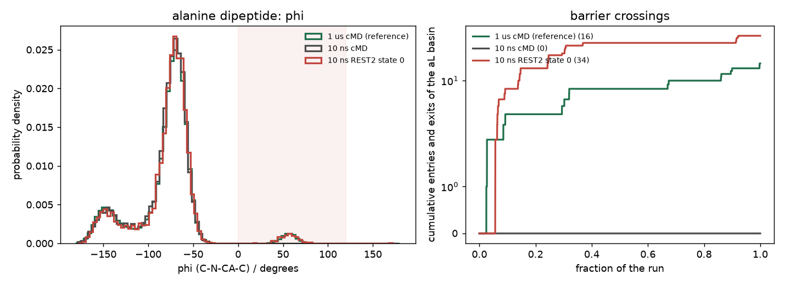
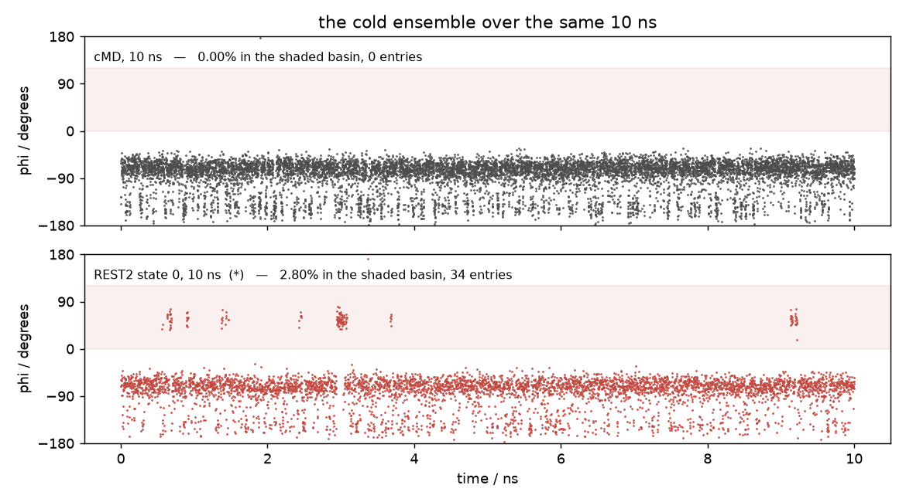

# cMD: alanine dipeptide in explicit water

**Tested against md-tools `0.6.1`.** Every command and every number on this page comes from a
run executed as written, at that version, on one NVIDIA RTX 3080.

10 ns of ordinary MD on the smallest system in this set. **Total time: 5 min 30 s**, of which the
production run is 5 min 14 s.

**Starts from a built system.** Do [the system page](index.md) first: it builds ACE-ALA-NME from a
`.seq` with tleap, solvates it and writes `ALA/build/built.xml`.

φ and ψ are the only interesting coordinates here, which is why this system is the one to check an
enhanced-sampling method on. Ten nanoseconds is **not** the reference for that check, though — as
[section 4](#4-what-10-ns-sampled-against-a-microsecond) shows, it misses a whole basin. The reference every
method on this system is compared against is a separate 1 µs run.

## 1. Generate the run

`cMD.config` at the dataset root:

```yaml
protocol: cMD
solvent: explicit

stages:
  minimization_iterations: 5000
  restrained_nvt_steps: 25000    # 100 ps
  restrained_npt_steps: 25000    # 100 ps
  unrestrained_npt_steps: 50000  # 200 ps
  production_steps: 2500000      # 10 ns at 4 fs

reporting:
  crd_printout_solute: 250       # a solute frame every 1 ps
  info_printout: 2500
  checkpoint_printout: 25000
```

```bash
cd ..                                            # ALA/
md-openmm build-md -odir ./cMD-run1 --config cMD.config
```

Every length is an integer step count. `timestep_fs` stays `auto` and resolves to **4.0 fs**, read
from the masses in `built.xml` rather than from this file — hydrogen mass repartitioning has to be
proved, not claimed. What `build-md` writes and checks:
[build-md](../../basics/build-md/index.md). Every key:
[the configuration reference](../../basics/build-md/configuration.md).

## 2. Run it

```bash
cd cMD-run1
CUDA_DEVICE_ORDER=PCI_BUS_ID CUDA_VISIBLE_DEVICES=0 ./run.sh
```

Without `PCI_BUS_ID`, CUDA may number the cards differently from `nvidia-smi`.

`run.sh` is five `md-run` calls in order:

| stage | what | ensemble | elapsed |
|---|---|---|---|
| `min` | energy minimisation, 5000 iterations | — | 1.0 s |
| `eq_1` | solute heavy atoms restrained | NVT | 3.8 s |
| `eq_2` | solute heavy atoms restrained | NPT | 4.1 s |
| `eq_3` | restraint released | NPT | 7.3 s |
| `cMD` | production, 10 ns | NPT | 313.5 s |

Run it again and every stage is skipped, because each already reports `status: completed` in its
own machine record; an interrupted stage resumes from its last checkpoint.

## 3. Result

From `cMD-run1/cMD.out`:

```text
System
  atoms                        1796
  residues                     597 (HOH 590, CL 2, NA 2, ACE 1, ALA 1, NME 1)
  net charge                   +0.000 e
  box                          3.000 x 3.000 x 2.121 nm  volume 19.092 nm^3
Run
  timestep                     4.0 fs
  steps                        2500000 (10000 ps)
  ensemble                     NPT
  platform                     CUDA
Averages
  over                         1000 report(s) in mdout.csv
  Temperature (K)              mean 300.996   rms fluctuation 6.88341
  Density (g/mL)               mean 0.994611   rms fluctuation 0.0114782
  Speed (ns/day)               mean 2758.35    rms fluctuation 98.4407
Summary
  cMD: 2500000 steps completed, 10000 ps
status               completed
```

The temperature sits at the 300 K thermostat and the density at that of water, which is what a
correctly built and equilibrated box looks like. At 2758 ns/day this is the fastest system in the
set — 22 atoms of solute in 590 waters, and the water is nearly all of the cost.

## 4. What 10 ns sampled, against a microsecond

φ and ψ are the whole story for this molecule, so it is worth asking what the run saw of them —
and on this system the honest answer needs something to compare against. The reference is a
separate **1 µs** run of the same box: 250 000 000 steps at 4 fs, 2821 ns/day, **8 h 32 m** on one
RTX A5000.



| run | time in the αL basin | entries into it | per ns |
|---|---|---|---|
| **1 µs cMD — the reference** | **2.76%** | 16 | 0.02 |
| 10 ns cMD — this page | **0.00%** | **0** | 0.00 |
| 10 ns REST2, state 0 \* | 2.80% | 34 | 3.40 |
\* **The ladder is not free.** Its four replicas each ran 10 ns, so it spent **40 ns of
aggregate sampling and about 4.8× the GPU-seconds** of the plain 10 ns run (4 × 374 s
against 314 s). Only state 0's 10 ns is usable output; the other three states exist to
ferry configurations across the barrier. The like-for-like question is therefore whether
40 ns of plain MD would have found the basin — it would not have: the 1 µs reference needs
about 60 ns per entry.


Watching the same 10 ns as a time series rather than a histogram makes the difference concrete:



The plain run never leaves the negative-φ region. The ladder's cold state — the **same**
Hamiltonian at the same temperature — visits αL seven separate times, and each visit lasts long
enough to be sampled rather than glanced at.

The two negative-φ basins are well sampled at 10 ns and the halves of the run agree on them to
2.6°, which looks like a converged result. **It is not.** The αL basin at φ ≈ +55° holds 2.76% of
the population, and 10 ns of plain MD visited it **zero times**.

That is what makes a short unbiased run dangerous rather than merely imprecise: it produces a
smooth, stable, entirely convincing histogram of a distribution it has not sampled, and nothing in
the run reports a problem. `status: completed` is true; the temperature and density are perfect;
the two halves agree. The missing basin is invisible from inside the run — it took a hundredfold
longer simulation to see that it was missing.

!!! note "Even the microsecond is thin where it matters"
    The reference spent 2.76% of a microsecond in αL, but it **entered the basin only 16 times**.
    An occupancy built from 16 independent visits carries roughly a quarter of its own value as
    uncertainty, however many frames were written. Length bought the basin; it did not buy
    precision on the basin, because precision comes from the number of times the barrier was
    crossed and that number stayed small.

    This is the argument for the ladder rather than for a longer run:
    [10 ns of REST2](REST2.md) crosses that barrier **34 times** — more events than the
    microsecond — and lands on 2.80% against the reference's 2.76%.

## 5. What it wrote

```text
ALA/
├── build/          built.xml, built.pdb, built.log
├── input/          min.in, eq_1.in, eq_2.in, eq_3.in, cMD.in
├── min/            min.xml, min.log, min.out, min.py
└── cMD-run1/
    ├── eq/                    eq_1.xml … eq_3.xml and their logs
    ├── solute_prod1.nc        solute trajectory, 10000 frames
    ├── mdout.csv              the state table, 1000 rows
    ├── energy_components.csv  the potential, term by term
    ├── cMD.xml                the final state
    ├── cMD.checkpoints/       the committed generations a resume continues from
    └── cMD.log                the machine-readable record
```

`input/` and `min/` are siblings of the run, not inside it: they belong to the system, and every
run on it shares them. Why, and what each file is: [the run layout](../../basics/run-layout.md).

## Next

* the same peptide switched rather than simulated: [AIS: alanine dipeptide](AIS.md)
* the same peptide across four scaled states: [REST2: alanine dipeptide](REST2.md)
* [the system page](index.md) — the other methods for alanine dipeptide
