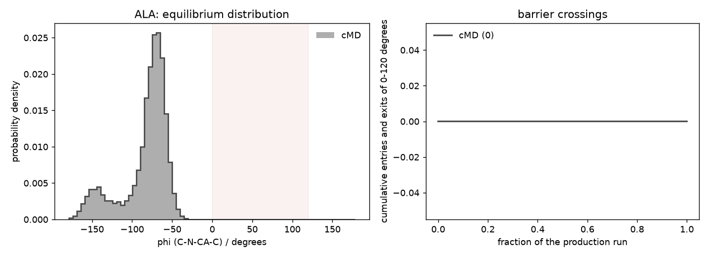

# cMD: alanine dipeptide in explicit water

**Tested against md-tools `0.6.1`.** Every command and every number on this page comes from a
run executed as written, at that version, on one NVIDIA RTX 3080.

10 ns of ordinary MD on the smallest system in this set. **Total time: 5 min 30 s**, of which the
production run is 5 min 14 s.

**Starts from a built system.** Do [the system page](index.md) first: it builds ACE-ALA-NME from a
`.seq` with tleap, solvates it and writes `ALA/build/built.xml`.

This is the page to read if you want the unbiased reference that
[AIS: alanine dipeptide](AIS.md) is compared against. φ and ψ are the only interesting coordinates
here, and 10 ns of plain MD crosses their barriers often enough to give a usable free-energy
surface — which is exactly why this system is the one to check an enhanced-sampling method on.

## 1. Generate the run

`cMD.config` at the dataset root:

```yaml
protocol: cMD
solvent: explicit

stages:
  minimization_iterations: 5000
  restrained_nvt_steps: 25000    # 100 ps
  restrained_npt_steps: 25000    # 100 ps
  unrestrained_npt_steps: 50000  # 200 ps
  production_steps: 2500000      # 10 ns at 4 fs

reporting:
  crd_printout_solute: 250       # a solute frame every 1 ps
  info_printout: 2500
  checkpoint_printout: 25000
```

```bash
cd ..                                            # ALA/
md-openmm build-md -odir ./cMD-run1 --config cMD.config
```

Every length is an integer step count. `timestep_fs` stays `auto` and resolves to **4.0 fs**, read
from the masses in `built.xml` rather than from this file — hydrogen mass repartitioning has to be
proved, not claimed. What `build-md` writes and checks:
[build-md](../../basics/build-md/index.md). Every key:
[the configuration reference](../../basics/build-md/configuration.md).

## 2. Run it

```bash
cd cMD-run1
CUDA_DEVICE_ORDER=PCI_BUS_ID CUDA_VISIBLE_DEVICES=0 ./run.sh
```

Without `PCI_BUS_ID`, CUDA may number the cards differently from `nvidia-smi`.

`run.sh` is five `md-run` calls in order:

| stage | what | ensemble | elapsed |
|---|---|---|---|
| `min` | energy minimisation, 5000 iterations | — | 1.0 s |
| `eq_1` | solute heavy atoms restrained | NVT | 3.8 s |
| `eq_2` | solute heavy atoms restrained | NPT | 4.1 s |
| `eq_3` | restraint released | NPT | 7.3 s |
| `cMD` | production, 10 ns | NPT | 313.5 s |

Run it again and every stage is skipped, because each already reports `status: completed` in its
own machine record; an interrupted stage resumes from its last checkpoint.

## 3. Result

From `cMD-run1/cMD.out`:

```text
System
  atoms                        1796
  residues                     597 (HOH 590, CL 2, NA 2, ACE 1, ALA 1, NME 1)
  net charge                   +0.000 e
  box                          3.000 x 3.000 x 2.121 nm  volume 19.092 nm^3
Run
  timestep                     4.0 fs
  steps                        2500000 (10000 ps)
  ensemble                     NPT
  platform                     CUDA
Averages
  over                         1000 report(s) in mdout.csv
  Temperature (K)              mean 300.996   rms fluctuation 6.88341
  Density (g/mL)               mean 0.994611   rms fluctuation 0.0114782
  Speed (ns/day)               mean 2758.35    rms fluctuation 98.4407
Summary
  cMD: 2500000 steps completed, 10000 ps
status               completed
```

The temperature sits at the 300 K thermostat and the density at that of water, which is what a
correctly built and equilibrated box looks like. At 2758 ns/day this is the fastest system in the
set — 22 atoms of solute in 590 waters, and the water is nearly all of the cost.

## 4. What 10 ns actually sampled

The reason this system is in the set is that φ and ψ are the whole story, so it is cheap to ask
what the run saw. [`compare_cmd_rest2.py`](../shared/compare_cmd_rest2.py), run from the dataset
root:

```bash
python compare_cmd_rest2.py --system ALA \
    --cmd cMD-run1 --cmd-build build --window 0 120 --out cmd-phi.png
```

```text
ALA: phi (C-N-CA-C)  [degrees]
  cMD   n=10000  mean=-84.14  sd=29.40  in-basin=0.00%  crossings=0
        first/second half mean=-85.46 / -82.82
```



The two negative-φ basins are well sampled and the halves of the run agree on them to 2.6°, which
looks like a converged result. **It is not.** The αL basin at φ ≈ +55° — a real, populated feature
of this molecule's free-energy surface — was visited **zero times in 10 ns**. The run has 0.00% of
its frames there and never once crossed into the window.

That is what makes a short unbiased run dangerous rather than merely imprecise: it produces a
smooth, stable, entirely convincing histogram of a distribution it has not sampled, and nothing in
the run reports a problem. `status: completed` is true; the temperature and density are perfect;
the two halves agree. The missing basin is invisible from inside the run.

!!! warning "A torsion is periodic, so count basins and not sides of a threshold"
    Counting crossings as `phi > 0` flips whenever the series wraps from −179° to +179°, which
    never passed through zero. Done that way this run reports **2** crossings instead of 0 — both
    of them wrap artifacts, on a coordinate it never actually left. The script counts entries and
    exits of a *window* for exactly this reason.

[The ladder](REST2.md) finds that basin 34 times in the same 10 ns, on the same Hamiltonian.

## 5. What it wrote

```text
ALA/
├── build/          built.xml, built.pdb, built.log
├── input/          min.in, eq_1.in, eq_2.in, eq_3.in, cMD.in
├── min/            min.xml, min.log, min.out, min.py
└── cMD-run1/
    ├── eq/                    eq_1.xml … eq_3.xml and their logs
    ├── solute_prod1.nc        solute trajectory, 10000 frames
    ├── mdout.csv              the state table, 1000 rows
    ├── energy_components.csv  the potential, term by term
    ├── cMD.xml                the final state
    ├── cMD.checkpoints/       the committed generations a resume continues from
    └── cMD.log                the machine-readable record
```

`input/` and `min/` are siblings of the run, not inside it: they belong to the system, and every
run on it shares them. Why, and what each file is: [the run layout](../../basics/run-layout.md).

## Next

* the same peptide switched rather than simulated: [AIS: alanine dipeptide](AIS.md)
* the same peptide across four scaled states: [REST2: alanine dipeptide](REST2.md)
* [the system page](index.md) — the other methods for alanine dipeptide
