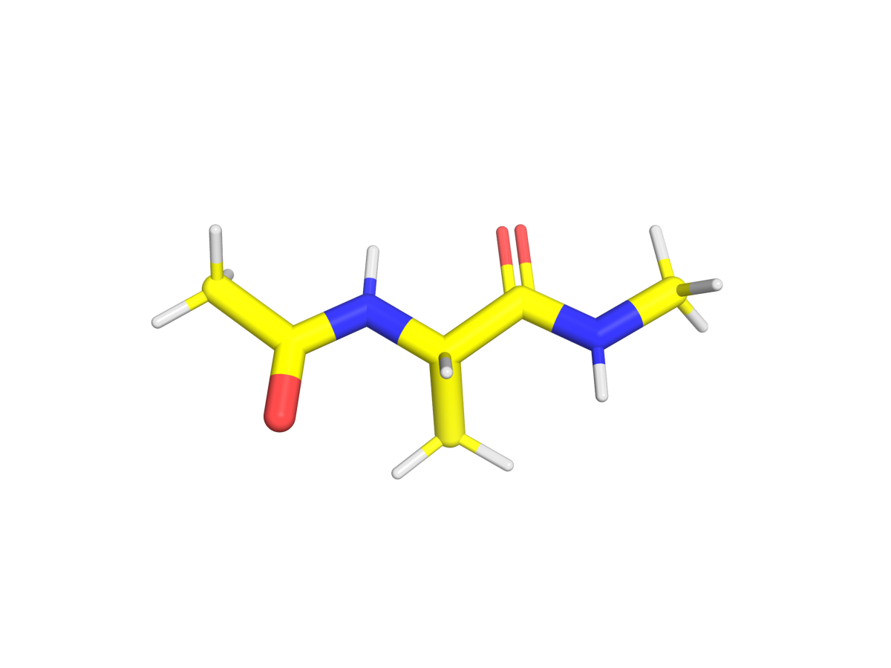

# Alanine dipeptide

**Tested against md-tools `0.5.4`.** The smallest system in this set: two peptide bonds capped at
both ends, 22 atoms, and the standard toy for everything that depends on backbone torsions.



*ACE–ALA–NME. Its two backbone torsions, φ and ψ, are the coordinates every method on this page
is measured against.*

## Why this system

φ and ψ have barriers of a few kT, so a plain simulation crosses them often enough to give a
reference distribution in minutes rather than days. That makes it the one system where an enhanced
method can be checked against the truth instead of against another enhanced method.

## Build it

The structure ships with the package as `tests/data/ALA.pdb`, and the build is one command. For an
explicit box:

```yaml
# build.config -- explicit solvent
solvent: {model: TIP3P, padding_nm: 1.0}
```

For implicit solvent, which for a system this small is often enough and has no box at all:

```yaml
# build.config -- implicit solvent
solvent: {model: GBn2}
```

```bash
md-openmm build-top -i ALA.pdb --config build.config \
    -os build/built.xml -op build/built.pdb -log build/built.log
```

An implicit build has no box, no barostat, no counter-ions and no NPT stage; the stages are
renamed accordingly rather than run at a pressure that means nothing.

## Where to go next

| method | what it is for | |
|---|---|---|
| [**AIS**](AIS.md) | annealed importance sampling between two Hamiltonians, with the torsion reweighting checked against the plain simulation | published |
| **cMD** | the unbiased reference | not written for this system |
| **REST2** | solute tempering | not written for this system |
| **Umbrella sampling** | a potential of mean force along φ | planned, 0.6.2 |
| **Alchemical (TI, FEP)** | free energies by transformation | planned, 0.7.0 |

*Umbrella sampling arrives in 0.6.2 and the alchemical pages in 0.7.0. They are listed here so the
shape of the set is visible; neither is written yet, and neither is linked to a page that does not
exist.*
