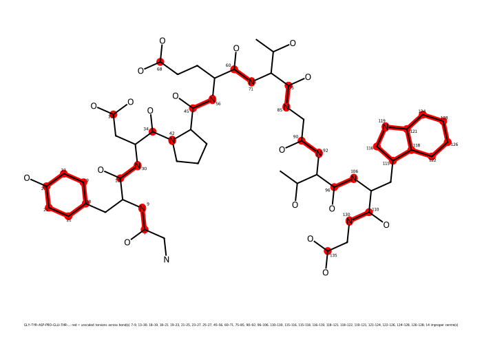

# REST2: chignolin in explicit water, six states on six GPUs

!!! note "Requires md-tools 0.5.4 or later"
    The scaled states are **files**, built once by `md-openmm build-top --rest2-scaler`. Earlier
    releases scaled at run time; their tutorials are [archived](../archived/README.md).

A six-state REST2 ladder over **chignolin**, the designed ten-residue miniprotein
([PDB 1UAO](https://www.rcsb.org/structure/1UAO), sequence GYDPETGTWG), from the deposited NMR
structure to 10 ns of production **per state**. Every command below was run exactly as written and
every number is copied from the files that run produced. md-tools **0.5.4** at commit `afb537f`, on
six NVIDIA RTX 3080 cards with CUDA and mixed precision.

The whole thing took **8 min 3 s**: building took 4 s, scaling 2 s, and minimisation through the
last exchange 7 min 57 s.

This is the peptide counterpart of [REST2: paracetamol](paracetamol.md). The steps are the same; what
differs is that a peptide needs no SDF — its unscaled torsions come from the residue table, not from
bond orders — and that the ladder has to be spaced more tightly, which
[step 6](#6-why-tau_max-is-03-and-not-05) measures rather than asserts.

## What REST2 does here

Six copies of the system — **states** — run side by side at 300 K, one per GPU. They differ only in
how strongly the solute interacts: state *i* scales solute–solute terms by (1−τ)² and solute–water
terms by (1−τ), with τ = 0, 0.06, 0.12, 0.18, 0.24, 0.3. State 0 is the real peptide. Every 2 ps,
neighbouring states try to swap configurations, so a conformation found where barriers are low can
reach state 0.

Some torsions are **never scaled**, because a hot state that bent them would sample geometries state
0 never visits: the backbone amide ω bonds, aromatic rings, and every improper. For chignolin that
is Tyr2 and Trp9's rings and the eight ordinary amides. **Pro4 is the exception** — a proline-like
amide has no N–H to protect, so it stays scalable, and the scaler says so.

## 1. The dataset root and the structure

```bash
mkdir -p CHI/build
cd CHI/build
```

1UAO is a solution-NMR entry with **18 models**. A build needs one:

```bash
curl -O https://files.rcsb.org/download/1UAO.pdb
awk '/^MODEL/{m++} m==1{print} /^ENDMDL/{if(m==1) exit}' 1UAO.pdb \
    | grep -E '^(ATOM|TER)' > chignolin.pdb
echo END >> chignolin.pdb
```

That leaves 138 atoms: the ten residues with their hydrogens, free termini, no ligands or
crystallographic water.

??? tip "Building it from the sequence instead"
    `build-top` also takes a `.seq` — one line of residue names that tleap's `sequence` builds:

    ```text
    NGLY TYR ASP PRO GLU THR GLY THR TRP CGLY
    ```

    ```bash
    md-openmm build-top -i chignolin.seq -os built.xml -op built.pdb \
        -log built.log --config build-top.config
    ```

    **Name the terminal residues.** A bare `GLY TYR ... TRP GLY` builds an uncapped chain and the
    force field then has no template for it:

    ```text
    ValueError: No template found for residue 9 (GLY).  The atoms and bonds in the residue match
    GLY, but the set of externally bonded atoms is missing 1 C atom.  Is the chain missing a
    terminal capping group?
    ```

    `NGLY`/`CGLY` give the charged termini 1UAO has, so the molecule is the same 138 atoms.
    `ACE ... NME` would cap it instead, which is a *different* molecule.

    **It is not a substitute for this page.** tleap's geometry is EXTENDED, not folded, so the same
    1.5 nm padding wraps a much larger box: 8173 atoms and 2673 waters in 86.1 nm³, against 2553
    and 803 in 28.7 nm³ here. Starting extended is the right choice for a folding study and the
    wrong one for reproducing these numbers.

## 2. Build the system

`build-top.config`:

```yaml
solute:
  kind: peptide
solvent:
  model: TIP3P
  padding_nm: 1.5
hydrogen_mass_repartitioning:
  enabled: true
```

```bash
md-openmm build-top -i chignolin.pdb -os built.xml -op built.pdb \
    -log built.log --config build-top.config
```

From `built.log`:

```text
Input interpretation
--------------------
  interpreted as              peptide/protein PDB
  small-molecule FF           not used (peptide-only input)
  solvent treatment           explicit TIP3P, periodic

Counts
------
  atoms                       2553
  residues                    819
  solute atoms                138
  waters                      803
  ions                        {'NA': 4, 'CL': 2}
```

Four Na⁺ against two Cl⁻ because chignolin carries −2, from Asp3 and Glu5. The box is a rhombic
dodecahedron of 28.7 nm³, and HMR lets every later stage run at 4 fs.

There is **no `built.sdf`**. A peptide does not need one: the next step reads the residue table.

## 3. Build the six scaled states

`scaler.config`, beside the built System:

```yaml
method: REST2
schedule:
  kind: linear
  n_states: 6
  tau_min: 0.0
  tau_max: 0.3
```

```bash
md-openmm build-top --rest2-scaler -s built.xml -p built.pdb --config scaler.config
```

It took 2 s and wrote `build/REST2/`:

```text
build/REST2/
├── system_state0.xml … system_state5.xml
├── scaler.yaml            what these files are and how they were made (sha256 of each)
├── scaler.log             the same, for a person
└── protein-unscaled.png   what stays unscaled, drawn
```

From `scaler.log`:

```text
  schedule                    linear, 6 state(s), tau 0.0 .. 0.3
  solute                      138 atom(s)
  unscaled torsions           amide omega 8 bond(s), aromatic ring 16 bond(s), double bond 0 bond(s), impropers 14 term(s)
                              138 torsion term(s) unscaled, 317 scaled
  proline-like amides         1 bond(s), scaled
```



Red bonds keep every torsion across them unscaled in every state; red atoms are the centres of
unscaled impropers. The eight backbone amides and both aromatic rings are protected. What REST2
heats are the 317 torsion terms left — the side chains, and the backbone φ/ψ that fold this peptide.

**The picture does not depend on τ.** Build the same system at `tau_max: 0.5` and this file is
byte-identical: which torsions are unscaled is a property of the molecule and the rules, not of how
hot the ladder gets.

## 4. Generate the ladder

`REST2.config` at the dataset root:

```yaml
protocol: REST2
solvent: explicit

rest2:
  number_of_replicas: 6          # must match build/REST2/scaler.yaml
  tau_max: 0.3                   # must match build/REST2/scaler.yaml
  exchange_interval_steps: 500   # 2 ps between exchange attempts at 4 fs
  number_of_exchanges: 5000      # 2,500,000 steps = 10 ns per state
  equilibration_steps: 25000     # 100 ps per state at its own Hamiltonian, before production

stages:
  minimization_iterations: 5000
  restrained_nvt_steps: 25000    # 100 ps
  restrained_npt_steps: 25000    # 100 ps
  unrestrained_npt_steps: 50000  # 200 ps

reporting:
  crd_printout_solute: 500       # a solute frame every 2 ps: 5000 frames per state
  crd_printout_whole: 25000      # every atom every 100 ps
  info_printout: 2500
  checkpoint_printout: 25000
```

```bash
cd ..                                            # CHI/
md-openmm build-md -odir ./REST2-run1 --config REST2.config
```

`number_of_replicas` and `tau_max` scale nothing — they are a **claim** about `build/REST2/`, and
`build-md` refuses if they disagree with it. The group file it writes names the saved states, one
per line:

```text
-i _protocol.py -p ../build/built.pdb -s ../build/REST2/system_state0.xml -c eq/eq_3.xml --group-index 0
…
-i _protocol.py -p ../build/built.pdb -s ../build/REST2/system_state5.xml -c eq/eq_3.xml --group-index 5
```

## 5. Run it

```bash
cd REST2-run1
CUDA_DEVICE_ORDER=PCI_BUS_ID CUDA_VISIBLE_DEVICES=1,2,3,4,5,6 ./run.sh
```

`run.sh` minimises and equilibrates once on the unscaled system (`min`, `eq_1`, `eq_2`, `eq_3` —
400 ps in total), then launches the ladder with one MPI rank per state and one GPU per rank.

!!! tip "Six identical cards"
    The six states are one job: a slow card holds up every exchange it takes part in, and mixed
    hardware makes the acceptance ratios below hard to read. These ran on six RTX 3080s.
    `CUDA_DEVICE_ORDER=PCI_BUS_ID` makes CUDA's numbering agree with `nvidia-smi`'s, so
    `CUDA_VISIBLE_DEVICES=1,2,3,4,5,6` means the cards you think it does.

Each rank records the device it got, and they are six different ones:

```text
# platform           : CUDA device=0 (machine.openmm.device_policy: local_rank (rank 0 of 6)), precision mixed
…
# platform           : CUDA device=5 (machine.openmm.device_policy: local_rank (rank 5 of 6)), precision mixed
```

It ended with `run.sh: all stages reported completion`.

## 6. Results

`remd_records/REST2_prod1.out`:

```text
# steps completed       : 2500000 of 2500000
# exchanges             : 5000 (every 500 steps = 2.0 ps)
# solute frames         : 5000 (every 500 steps)
# production per replica: 10000.0 ps
# final state->walker   : [1, 5, 2, 3, 4, 0]
# NEIGHBOURING-PAIR acceptance:
#   state 0 <-> state 1   389/2500   0.156
#   state 1 <-> state 2   345/2500   0.138
#   state 2 <-> state 3   300/2500   0.120
#   state 3 <-> state 4   330/2500   0.132
#   state 4 <-> state 5   298/2500   0.119
#   overall               1662/12500   0.133
# REST2:
#   tau ladder            0, 0.06, 0.12, 0.18, 0.24, 0.3   (6 state(s), one temperature 300.0 K, NVT)
#   solute region         138 atom(s), 24 unscaled central bond(s), impropers unscaled
# TIMINGS:
#   elapsed               446.4 s
#   throughput            1935.34 ns/day per replica, 11612.07 ns/day aggregate over 6 state(s)
```

Acceptance is even across all five pairs — 0.119 to 0.156 — which is what a well-spaced linear
ladder looks like. `final state->walker` is `[1, 5, 2, 3, 4, 0]`: no walker ended where it started,
so configurations did travel.

Each state has its own trajectory, `solute_state<i>_prod1.nc`, 5000 frames of the 138 solute atoms.
The index is the **state's**, not the walker's: `solute_state0_prod1.nc` is the unscaled ensemble,
which is the one to analyse.

## 6b. Why `tau_max` is 0.3 and not 0.5 {#6-why-tau_max-is-03-and-not-05}

The [paracetamol ladder](paracetamol.md) spans τ 0 → 0.5 in four states and accepts 0.223. The same
span over chignolin, in six states, does not work:

| ladder | solute atoms | states | τ span | overall acceptance |
|---|---|---|---|---|
| paracetamol | 20 | 4 | 0 → 0.5 | 0.223 |
| chignolin | 138 | 6 | 0 → 0.5 | **0.010** |
| chignolin | 138 | 6 | 0 → 0.3 | **0.133** |

Both chignolin runs took the same 8 minutes and the same 1935 ns/day per replica — the cost is
identical and only the spacing differs. The middle row is a ladder that completes, reports, and
exchanges almost nothing: at 1% the six states are close to six independent simulations, and the
whole point of REST2 is lost while every file still looks right.

The reason is size. The energy difference between neighbouring states grows with the solute, so the
τ spacing that works for a 20-atom molecule is far too coarse for a 138-atom peptide. Halving the
span halves the gap and acceptance rises thirteenfold.

md-tools **reports acceptance and does not enforce it**, and the ladder is linear in τ with no
spacing optimisation ([REST2](../../openmm_methods/REST2/README.md)). So this is a number to read
every time: if the pairs are much below ~0.1, tighten `tau_max` or add states, and remember that
adding states means adding GPUs.

## See also

* the same ladder for a small molecule: [REST2: paracetamol](paracetamol.md)
* what the scaled states are: [REST2](../../openmm_methods/REST2/README.md)
* a peptide built from a sequence, switched rather than exchanged: [AIS: alanine dipeptide](../AIS/alanine.md)
