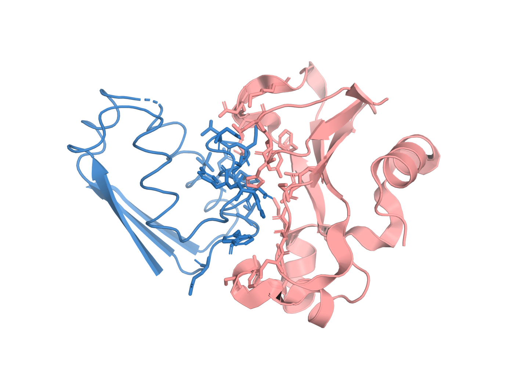

# Barnase and barstar

**Tested against md-tools `0.5.4`.** A protein–protein complex: barnase (an RNase) bound to its
inhibitor barstar, from PDB 1BRS — one of the best-characterised protein–protein interfaces there
is.



*1BRS chains A (barnase, salmon) and D (barstar, blue). Sidechains within 4.5 Å across the
interface are drawn as sticks; the interface is mostly charged and tightly packed.*

## Why this system

It is the protein–protein case: two folded chains whose ASSOCIATION is the quantity of interest.
That makes it the system where the useful coordinate is a distance between two molecules rather
than a torsion inside one, and where imaging the trajectory correctly matters before anything is
measured.

## Build it

```bash
curl -O https://files.rcsb.org/download/1BRS.pdb
```

1BRS holds three copies of the complex; the tutorial uses assembly 3 — chains A and D — and says
so, because building "the structure" without choosing would silently give three complexes in one
box.

```yaml
# build.config
solvent: {model: TIP3P, padding_nm: 1.0}
constraints: {type: HBonds, rigid_water: true}
```

```bash
md-openmm build-top -i 1BRS.pdb --config build.config \
    -os build/built.xml -op build/built.pdb -log build/built.log
```

About 29,700 atoms solvated. Protonation is assigned by PROPKA and recorded.

## Where to go next

| method | what it is for | |
|---|---|---|
| [**cMD**](cMD.md) | the complex simulated unbiased, 10 ns | published |
| **REST2** | heating the interface sidechains | not written for this system |
| **Umbrella sampling** | a potential of mean force along the chain–chain centre-of-mass distance | planned, 0.6.2 |
| **Alchemical (TI, FEP)** | free energies by transformation | planned, 0.7.0 |

*Umbrella sampling arrives in 0.6.2 and the alchemical pages in 0.7.0. They are listed here so the
shape of the set is visible; neither is written yet, and neither is linked to a page that does not
exist.*
