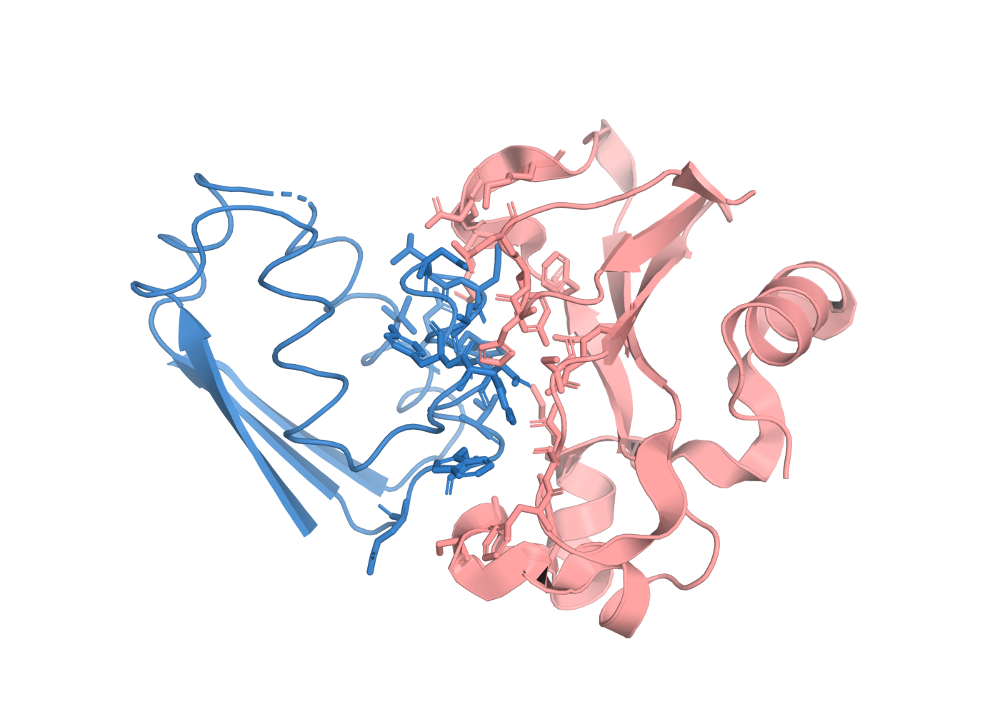

# Barnase and barstar

**Provenance.** This page uses `input.assembly`, `input.missing_atoms` and
`protonation.method: propka`, none of which exist in 0.5.4: it was executed at commit `cbc617a`,
between 0.5.4 and 0.6.0. **It has not been re-run for 0.6.1**, and its counts predate changes to
crystal-solvent retention and box geometry — see the note under *Build it*.

A protein–protein complex: barnase (an RNase) bound to its inhibitor barstar, from PDB 1BRS — one
of the best-characterised protein–protein interfaces there is.



*1BRS chains A (barnase, salmon) and D (barstar, blue). Sidechains within 4.5 Å across the
interface are drawn as sticks; the interface is mostly charged and tightly packed.*

## Why this system

It is the protein–protein case: two folded chains whose ASSOCIATION is the quantity of interest.
That makes it the system where the useful coordinate is a distance between two molecules rather
than a torsion inside one, and where imaging the trajectory correctly matters before anything is
measured.

## 1. The structure, and the choices it needs

```bash
mkdir -p 1BRS/build
cd 1BRS/build
curl -O https://files.rcsb.org/download/1BRS.cif      # sha256 1c98dcc3...5704f153
```

The asymmetric unit holds **three** barnase–barstar complexes, and the entry defines each as a
biological assembly: 1 is chains A + D, 2 is B + E, 3 is C + F. They are not interchangeable:

| assembly | barnase | barstar | as deposited |
|---|---|---|---|
| 1 | A | D | barstar residues 64–65 **missing inside the chain** |
| 2 | B | E | barstar residues 64–65 **missing inside the chain** |
| 3 | C | F | no gap; **44 side-chain atoms missing** over 15 residues |

md-tools refuses a gap inside a chain -- building one is loop modelling, which it does not invent --
so this tutorial builds **assembly 3**. Its missing side-chain atoms are built with PDBFixer and
every one of them is recorded; they carry no crystallographic evidence.

The barstar in 1BRS is an engineered double mutant, C40A/C82A (`SEQADV` records), so it has no
cysteine. Barnase residues 1–2 and the C-terminal residues missing from the deposit are not built:
each chain starts and ends at its first and last observed residue.

## 2. The build configuration

`build-top.config`:

```yaml
# 1BRS barnase-barstar: biological assembly 3 (author chains C = barnase, F = barstar), the only
# pair without a chain break; its 44 missing side-chain atoms are built and recorded.
solute:
  kind: peptide
input:
  assembly: "3"
  missing_atoms: add
protonation:
  method: propka
  ph: 7.0
forcefield:
  protein: ff14SB
solvent:
  model: TIP3P
  padding_nm: 1.5
  ionic_strength_molar: 0.15
```

* `input.assembly: "3"` expands that biological assembly from the mmCIF before anything else reads
  it. Each copy of a chain gets its own chain id -- here **A is barnase (author chain C)** and
  **B is barstar (author chain F)** -- and `build/assembly.json` maps each back to its author chain,
  label_asym ids and symmetry operator.
* `input.missing_atoms: add` builds the missing heavy atoms. The default, `refuse`, stops the build
  and lists them.
* `protonation.method: propka` predicts pKa values with PROPKA 3.5.1 on the prepared structure and
  assigns residue variants by one stated rule (see [Building a system](../../basics/build-top/index.md)).
  The default, `openmm`, is what earlier releases did.
* The 90 crystal waters of assembly 3 are kept, and placed after the protein in the topology.

## 3. Build

```bash
md-openmm build-top -i 1BRS.cif \
    -os built.xml -op built.pdb -log built.log --config build-top.config
```

What the log reports:

```text
Command
  input                       1BRS.cif
  assembly                    3: 2 chain(s), 0 on-axis copy(ies) dropped
  missing atoms               44 atom(s) added to 15 residue(s) (input.missing_atoms: add)
Preparation
  protonation  : pH 7.0, 0 -> 1730 hydrogens
  protonation  : method propka, PROPKA 3.5.1
    A:18 HIS pKa 6.04 -> HID (propka (neutral) + openmm hydrogen-bond heuristic for HID/HIE) [near_ph]
    A:73 GLU pKa 6.69 -> GLU (propka) [near_ph]
  solvation    : 8757 waters, ions {'NA': 28, 'CL': 24}, box dodecahedron (315.5 nm^3)
Counts
  atoms                       29725
  solute atoms                3132
  waters                      8847
  ions                        {'NA': 28, 'CL': 24}
```

!!! note "The solute is reproducible; the water count is not a fixed number"
    Re-running this build at **0.6.1** gives the same solute exactly — 3132 solute atoms, the same
    44 atoms added to the same 15 residues, the same 28 Na⁺ and 24 Cl⁻, the same 90 crystal waters
    kept — and a slightly larger box: 317.9 nm³ against 315.5, and 8823 added waters against 8757,
    for 29923 atoms rather than 29725. That is a 0.8 % change in box volume between `cbc617a` and
    0.6.1, and the waters follow it.

    Treat every solvent count on this page as a record of one build, not a target. The number of
    waters a box takes depends on the box the padding rule produces and on where the packing
    happens to place them; two builds of the same structure can differ by a handful even at one
    version. What must match, and does, is the solute: its atoms, its completed side chains, its
    protonation and its net charge.

**Reading the protonation.** PROPKA predicts every titratable group; md-tools prints the ones worth
a second look. Barnase His18 (pKa 6.04) and Glu73 (6.69) are within one pH unit of 7, so their
assigned states -- neutral His, deprotonated Glu -- should be read as uncertain. The other two
histidines, barnase His102 (4.83) and barstar His17 (4.24), are predicted neutral too. PROPKA does
not decide between the neutral tautomers HID and HIE; OpenMM's hydrogen-bond heuristic chose HID for
all three. If a tautomer matters to your question, set it explicitly:

```yaml
protonation:
  method: propka
  overrides:
    - select: {chain: A, resid: "102"}
      variant: HIE
```

Every prediction, assignment, override and warning is in the machine record at the end of
`built.log` under `protonation`, and PROPKA's own report is kept.

The added side-chain atoms are listed under `structure_completion`: barnase Lys19, Asp22, Glu29,
Gln31, Lys39, Val45, Lys49, Ser67 and Arg110, and barstar Lys22, Glu28, Glu46, Glu64, Asn65 and
Ser89 -- surface residues whose side chains were disordered in the crystal.

## Where to go next

| method | what it is for | |
|---|---|---|
| [**cMD**](cMD.md) | the complex simulated unbiased, 10 ns | published |
| **REST2** | heating the interface sidechains | not written for this system |
| **Umbrella sampling** | a potential of mean force along the chain–chain centre-of-mass distance | planned, 0.6.2 |
| **Alchemical (TI, FEP)** | free energies by transformation | planned, 0.7.0 |

*Umbrella sampling arrives in 0.6.2 and the alchemical pages in 0.7.0. They are listed here so the
shape of the set is visible; neither is written yet, and neither is linked to a page that does not
exist.*
