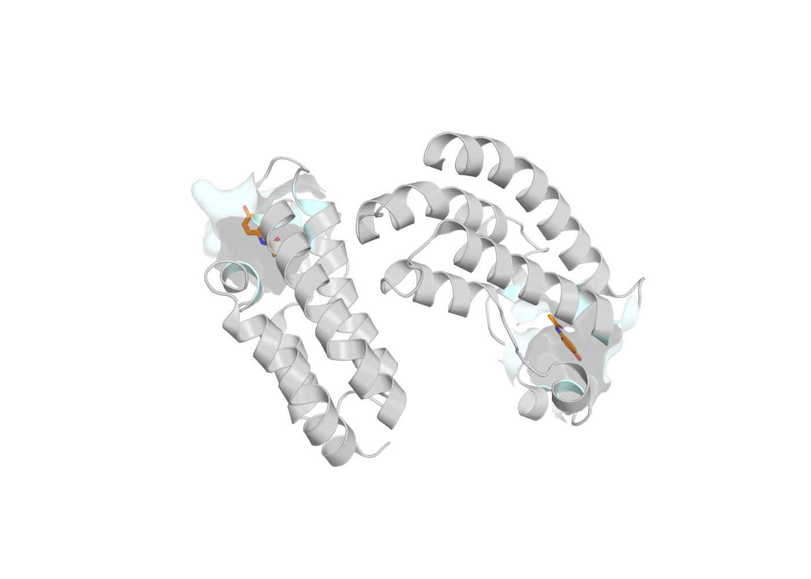

# Bromodomain with paracetamol

**Tested against md-tools `0.5.4`.** A protein–ligand complex: a bromodomain from PDB 4A9K with
paracetamol in its acetyl-lysine site.



*4A9K, assembly 1. The ligand is orange; the residues within 5 Å of it are drawn as a translucent
surface. Crystallographic waters, ethylene glycol and ions are removed by the build.*

## Why this system

It is the smallest honest protein–ligand complex in this set — a real binding site, a real ligand,
and small enough to build and run on one card. It is also where a ligand parameter package made for
one purpose is REUSED in another: the same paracetamol package that the ligand-only tutorials
produce is the one this complex consumes.

## Build it

```bash
curl -O https://files.rcsb.org/download/4A9K.pdb
```

The complex build names the ligand instance and the package it resolves to:

```yaml
# build.config
solute: {kind: complex}
ligands:
  - select: {resname: TYL}
    parameters: <compound-id>/<parameter-id>
solvent: {model: TIP3P, padding_nm: 1.0}
```

```bash
md-openmm build-top -i 4A9K.pdb --config build.config \
    -os build/built.xml -op build/built.pdb -log build/built.log
```

Protonation is a stated choice rather than a default: the tutorial runs PROPKA and records what it
decided, so a later reader can see which histidines were which.

## Where to go next

| method | what it is for | |
|---|---|---|
| [**cMD**](cMD.md) | the complex simulated unbiased, with the ligand's package reused | published |
| **REST2** | heating the ligand, or the ligand and its pocket | see [TYK2](../tyk2-ejm31/index.md) for this on a kinase |
| **Umbrella sampling** | a potential of mean force along the ligand–protein centre-of-mass distance | planned, 0.6.2 |
| **Alchemical (TI, FEP)** | absolute and relative binding free energies | planned, 0.7.0 |

*Umbrella sampling arrives in 0.6.2 and the alchemical pages in 0.7.0. They are listed here so the
shape of the set is visible; neither is written yet, and neither is linked to a page that does not
exist.*
