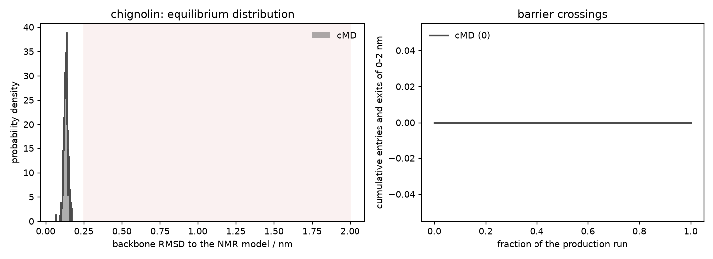

# cMD: chignolin in explicit water

**Tested against md-tools `0.6.1`.** Every command and every number comes from a run executed as
written, at that version, on one RTX 3080.

1 ns of ordinary MD on the folded NMR structure of [chignolin](index.md). **Total time: 1 min 4 s.**

**Starts from a built system.** Do [the system page](index.md) first: it takes the first NMR
model of 1UAO and writes `CHI/build/built.xml`, `built.pdb` and `built.log`.

## 1. Generate the run

`cMD.config` at the dataset root:

```yaml
protocol: cMD
solvent: explicit

stages:
  minimization_iterations: 5000
  restrained_nvt_steps: 25000    # 100 ps
  restrained_npt_steps: 25000    # 100 ps
  unrestrained_npt_steps: 50000  # 200 ps
  production_steps: 250000       # 1 ns at 4 fs

reporting:
  crd_printout_solute: 500       # a solute frame every 2 ps
  info_printout: 2500
  checkpoint_printout: 25000
```

```bash
cd ..                                            # CHI/
md-openmm build-md -odir ./cMD-run1 --config cMD.config
```

Lengths are integer step counts. `timestep_fs` stays `auto` and resolves to **4.0 fs**, read from
the masses in `built.xml` rather than from this file — HMR has to be proved, not claimed. What
`build-md` writes and checks: [build-md](../../basics/build-md/index.md). Every key:
[the configuration reference](../../basics/build-md/configuration.md).

## 2. Run it

```bash
cd cMD-run1
CUDA_DEVICE_ORDER=PCI_BUS_ID CUDA_VISIBLE_DEVICES=1 ./run.sh
```

`run.sh` is five `md-run` calls in order — minimisation, three equilibration stages, production:

```text
== min ==     min: 0 steps completed, 0 ps
== eq_1 ==    eq_nvt_posres: 25000 steps completed, 100 ps
== eq_2 ==    eq_npt_posres: 25000 steps completed, 100 ps
== eq_3 ==    eq_npt_free:   50000 steps completed, 200 ps
== cMD ==     cMD:          250000 steps completed, 1000 ps
```

## 3. What it wrote

```text
CHI/
├── build/          built.xml, built.pdb, built.log
├── input/          min.in, eq_1.in, eq_2.in, eq_3.in, cMD.in
├── min/            min.xml, min.log, min.out, min.py
└── cMD-run1/
    ├── eq/                    eq_1.xml … eq_3.xml and their logs
    ├── solute_prod1.nc        solute trajectory, 500 frames (855 kB)
    ├── mdout.csv              the state table, 100 rows
    ├── energy_components.csv  the potential, term by term
    ├── cMD.xml                the final state
    ├── cMD.checkpoints/       the committed generations a resume continues from
    └── cMD.log                the machine-readable record
```

`input/` and `min/` are siblings of the run, not inside it: they belong to the system, and every
run on it shares them. Why, and what each file is: [the run layout](../../basics/run-layout.md).

From `cMD.out`:

```text
  timestep                     4.0 fs
  steps                        250000 (1000 ps)
  ensemble                     NPT
  platform                     CUDA
  Speed (ns/day)               mean 2328     rms fluctuation 249.339
  elapsed                      37.1 s
```

`mdout.csv` opens at step 102500, not at zero: the step counter is absolute across the chain.

## 4. What 1 ns sampled

Chignolin is here because it has a real folding equilibrium. Asking what the run saw of it, with
[`compare_cmd_rest2.py`](../shared/compare_cmd_rest2.py):

```bash
python compare_cmd_rest2.py --system chignolin \
    --cmd cMD-run1 --cmd-build build --window 0.25 2.0 --out cmd-rmsd.png
```

```text
chignolin: backbone RMSD to the NMR model  [nm]
  cMD   n=500  mean=0.13  sd=0.01  in-basin=0.00%  crossings=0
        first/second half mean=0.13 / 0.13
```



The peptide sits at 0.13 nm from the deposited structure and never leaves: **0.00% of frames above
0.25 nm, and not one excursion.** The two halves agree to 0.00 nm.

That is the correct result for 1 ns and tells you nothing about folding. Chignolin's unfolding
happens on the microsecond scale, so a nanosecond samples fluctuations *within* the folded state
and nothing else — the narrow peak is a picture of one basin, not of an equilibrium between two.
A run like this is a good check that the build is sound and a bad basis for any statement about
stability.

Extending to 10 ns does not change it: still 0.00% and zero crossings.
[The ladder](REST2.md) reaches 5.14% in 10 ns.

## Next

1 ns is a demonstration. Chignolin folds on the microsecond scale, so raise `production_steps` —
or use the ladder:

* [REST2: chignolin](REST2.md) — the same peptide across six scaled states
* [the system page](index.md) — the other methods for chignolin
