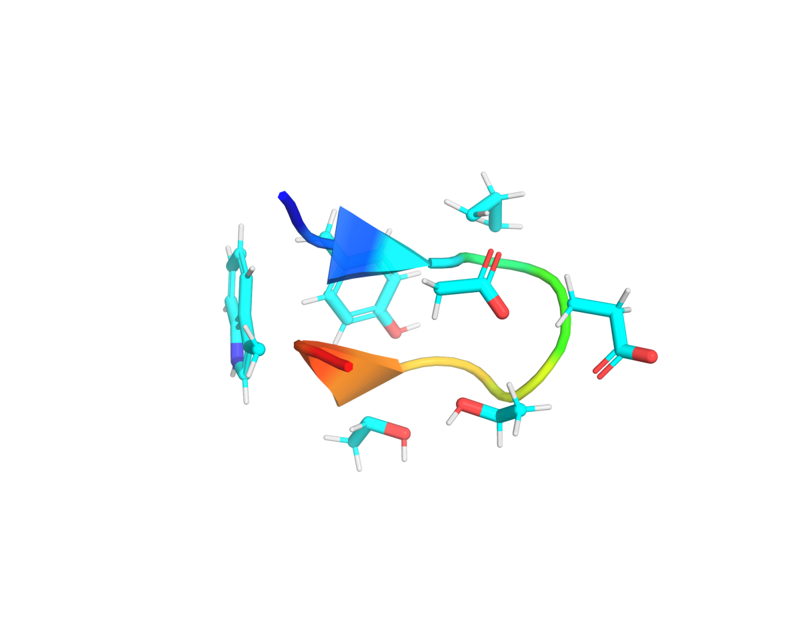

# Chignolin

**Tested against md-tools `0.5.4`.** A ten-residue designed peptide that folds into a β-hairpin —
the smallest system in this set with a real folding equilibrium.



*Chignolin (PDB 1UAO, first NMR model), coloured from N to C terminus. The hairpin is the fold;
the two termini sit side by side when it is formed.*

## Why this system

Folding and unfolding are slow compared with a torsion rotation but fast compared with a protein,
so chignolin is where an enhanced-sampling method can be shown to reach a state that plain MD
reaches only occasionally — and where the two can still be compared in a day.

## Build it

```bash
curl -O https://files.rcsb.org/download/1UAO.pdb
```

The file holds eighteen NMR models; the build uses the first. Explicit solvent:

```yaml
# build.config
solvent: {model: TIP3P, padding_nm: 1.0}
constraints: {type: HBonds, rigid_water: true}
```

```bash
md-openmm build-top -i 1UAO.pdb --config build.config \
    -os build/built.xml -op build/built.pdb -log build/built.log
```

About 2,550 atoms once solvated, which runs at nanoseconds per minute on one card.

## Where to go next

| method | what it is for | |
|---|---|---|
| [**cMD**](cMD.md) | the unbiased reference, 1 ns at 4 fs with HMR | published |
| [**REST2**](REST2.md) | solute tempering over the whole peptide | published |
| **AIS** | annealed importance sampling | not written for this system |
| **Umbrella sampling** | a potential of mean force along an end-to-end distance | planned, 0.6.2 |
| **Alchemical (TI, FEP)** | free energies by transformation | planned, 0.7.0 |

*Umbrella sampling arrives in 0.6.2 and the alchemical pages in 0.7.0. They are listed here so the
shape of the set is visible; neither is written yet, and neither is linked to a page that does not
exist.*
