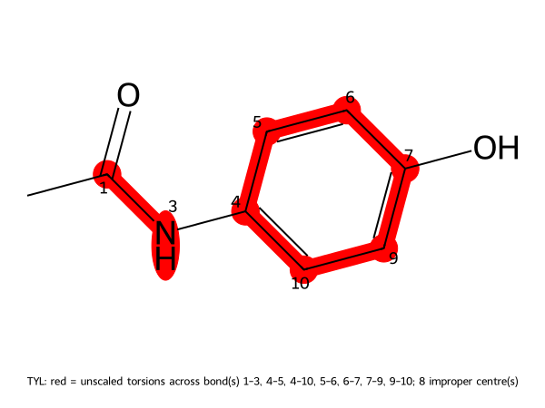

# REST2: paracetamol in explicit water, 10 ns per state

**Tested against md-tools `0.6.1`.** Every command and every number on this page comes from a
run executed as written, at that version.

A four-state REST2 ladder over paracetamol, 10 ns of production **per state**. Every command below
was run exactly as written, and every number is copied from the files that run produced.

The molecule is **not parameterised here**: this page reuses the package
[cMD: paracetamol](../paracetamol/cMD.md) makes, so read that page first if you want to know where
ligand parameters come from. The charge calculation happens once, there.

The ladder took 25.4 min on one shared GPU, plus a few seconds to build and scale.

## What this runs

Four copies at 300 K, differing only in how strongly the solute interacts: state *i* scales
solute–solute terms by (1−τ)² and solute–water by (1−τ), τ = 0, 0.167, 0.333, 0.5. State 0 is the
real molecule, and neighbours swap configurations every 2 ps. Amide ω, aromatic rings, other double
bonds and impropers are never scaled. The method:
[REST2](../../openmm_methods/REST2/README.md).

## 1. The dataset root

A REST2 ladder gets its **own** dataset root, beside the cMD one rather than inside it: `input/` is
shared by every run on a system, and this ladder's equilibration stages are longer than the cMD
page's, so `build-md` refuses to overwrite them. The parameters are shared; the box is not.

```bash
mkdir -p REST2-PARA/build
cd REST2-PARA/build
cp "$MD_DATA/parameters/ligands/CHEMBL112/param_e932f4c4f371/TYL.sdf" paracetamol.sdf
```

## 2. Build the system, from the registered package

`build-top.config`:

```yaml
solute:
  kind: ligand
  residue_name: TYL
  parameters: CHEMBL112/param_e932f4c4f371
```

```bash
md-openmm build-top -i paracetamol.sdf \
    -os built.xml -op built.pdb -log built.log --config build-top.config
```

```text
Resolved configuration
  solute.parameters           CHEMBL112/param_e932f4c4f371   (set)
  residue name                TYL   (stated)
Preparation
  parameters   : CHEMBL112/param_e932f4c4f371 (reused (stated reference))
  solvation    : 592 waters, ions {'NA': 2, 'CL': 2}, box dodecahedron (19.1 nm^3)
Counts
  atoms                       1800
  solute atoms                20
```

`parameters` names the package **by identity**, with no path: it is resolved in the shared catalog
under `$MD_DATA/parameters/ligands`, where `md-openmm data-register --ligand-package` put it. A
package that is not registered is named by its path instead — see
[cMD: paracetamol](../paracetamol/cMD.md).

`reused (stated reference)` means no charge was generated here. This box and the cMD page's box
rest on the same numbers, which is the point: a comparison between the two runs is a comparison of
sampling, not of parameters.

It also writes `TYL.sdf` beside the System. **Keep it**: it holds the bond orders, which is how the
next step knows which bonds are aromatic and which C–N is an amide.

## 3. Build the scaled states

`scaler.config`, beside the built System:

```yaml
method: REST2
schedule:
  kind: linear
  n_states: 4
  tau_min: 0.0
  tau_max: 0.5
```

```bash
md-openmm build-top --rest2-scaler -s built.xml -p built.pdb --config scaler.config
```

It took 1 s and wrote `build/REST2/`:

```text
build/REST2/
├── system_state0.xml  system_state1.xml  system_state2.xml  system_state3.xml
├── scaler.yaml          what these files are and how they were made (sha256 of each)
├── scaler.log           the same, for a person
└── TYL-unscaled.png     what stays unscaled, drawn
```

From `scaler.log`:

```text
  schedule                    linear, 4 state(s), tau 0.0 .. 0.5
  solute                      20 atom(s)
  unscaled torsions           amide omega 1 bond(s), aromatic ring 6 bond(s), double bond 0 bond(s), impropers 24 term(s)
                              56 torsion term(s) unscaled, 18 scaled
  SDF for TYL                 TYL.sdf
```

and `TYL-unscaled.png` — every red bond keeps all its torsions unscaled in every state, and every red
atom is the centre of an unscaled improper; the numbers are the atom indices `scaler.yaml` uses:



The amide (1–3) and the whole ring are protected. What REST2 *does* heat are the 18 torsion terms
left: the methyl rotation, the ring's rotation about the N–C bond — the **1-3-4-5** torsion, in the
atom numbering this picture and `scaler.yaml` use — and the O–H rotation.

## 4. Generate the ladder

`REST2.config` at the dataset root:

```yaml
protocol: REST2
solvent: explicit

rest2:
  number_of_replicas: 4          # must match build/REST2/scaler.yaml
  tau_max: 0.5                   # must match build/REST2/scaler.yaml
  exchange_interval_steps: 1000  # 2 ps between exchange attempts
  number_of_exchanges: 5000      # 5,000,000 steps = 10 ns per state
  equilibration_steps: 50000     # 100 ps per state at its own Hamiltonian, before production

stages:
  minimization_iterations: 5000
  restrained_nvt_steps: 50000    # 100 ps
  restrained_npt_steps: 50000    # 100 ps
  unrestrained_npt_steps: 100000 # 200 ps

reporting:
  crd_printout_solute: 1000      # a solute frame every 2 ps: 5000 frames per state
  crd_printout_whole: 50000      # every atom every 100 ps
  info_printout: 5000
  checkpoint_printout: 50000
```

`number_of_replicas` and `tau_max` do not scale anything any more — they are a **claim** about
`build/REST2/`, and `build-md` refuses if they disagree with it.

```bash
cd ..                                            # REST2-PARA/
md-openmm build-md -odir ./REST2-run1 --config REST2.config
```

The group file it writes names the saved states, one per line:

```text
-i _protocol.py -p ../build/built.pdb -s ../build/REST2/system_state0.xml -c eq/eq_3.xml --group-index 0
-i _protocol.py -p ../build/built.pdb -s ../build/REST2/system_state1.xml -c eq/eq_3.xml --group-index 1
-i _protocol.py -p ../build/built.pdb -s ../build/REST2/system_state2.xml -c eq/eq_3.xml --group-index 2
-i _protocol.py -p ../build/built.pdb -s ../build/REST2/system_state3.xml -c eq/eq_3.xml --group-index 3
```

## 5. Run it

Four replicas need four workers. Give each one its own GPU if you have them:

```bash
cd REST2-run1
CUDA_DEVICE_ORDER=PCI_BUS_ID CUDA_VISIBLE_DEVICES=1,2,3,4 ./run.sh
```

This run had **one** card, so the four workers shared it — which md-tools allows only under
NVIDIA MPS, and refuses otherwise:

```text
md-run: REST2: this launch shares device 0 between 4 workers. NVIDIA MPS is not-a-client for this
process ... Without MPS, workers on one GPU are time-sliced: each waits for the others' kernels,
and a synchronous ladder runs at the pace of that shared GPU.
```

md-tools neither starts nor stops the daemon — that is the operator's decision, because an MPS
daemon outlives the run. Start one that belongs to you, run, and stop it:

```bash
export CUDA_MPS_PIPE_DIRECTORY="$HOME/.cache/mps/pipe"    # keep this path SHORT: it holds a Unix
export CUDA_MPS_LOG_DIRECTORY="$HOME/.cache/mps/log"      # socket, and those cap at 108 characters
mkdir -p "$CUDA_MPS_PIPE_DIRECTORY" "$CUDA_MPS_LOG_DIRECTORY"
CUDA_VISIBLE_DEVICES=0 nvidia-cuda-mps-control -d

CUDA_DEVICE_ORDER=PCI_BUS_ID CUDA_VISIBLE_DEVICES=0 ./run.sh

echo quit | nvidia-cuda-mps-control
```

A private pipe directory matters: with the default one the daemon serves **every** card on the
host, so a shared machine's other GPUs end up behind your daemon.

`run.sh` minimises and equilibrates once on the unscaled system (`min`, `eq_1`, `eq_2`, `eq_3`),
then launches the ladder, one MPI rank per state:

```text
mpirun -n 4 md-openmm md-run -ng 4 -i ../input/REST2.in -p "${TOPOLOGY}" \
  --groupfile remd_groupfile.1 -odir . \
  -o remd_records/REST2_prod1.out -log remd_records/REST2_prod1.log -r remd_records/restart_prod1.json
```

!!! tip "Which GPU is which"
    CUDA numbers devices fastest first, `nvidia-smi` by PCI bus, so on a machine with mixed cards
    `CUDA_VISIBLE_DEVICES=1,2,3,4` need not be the GPUs `nvidia-smi` lists as 1–4. Put
    `CUDA_DEVICE_ORDER=PCI_BUS_ID` in front to make the two numberings agree.

It finished in 19.5 min and ended with `run.sh: all stages reported completion`. Stages that had
already completed were skipped, not repeated — only the ladder ran.

## 6. Results

`remd_records/REST2_prod1.out`:

```text
# steps completed       : 5000000 of 5000000
# exchanges             : 5000 (every 1000 steps = 2.0 ps)
# whole frames          : 100 (every 50000 steps)
# solute frames         : 5000 (every 1000 steps)
# production per replica: 10000.0 ps
# exchange rule         : neighbouring
# final state->walker   : [0, 3, 1, 2]
# NEIGHBOURING-PAIR acceptance:
#   basis: cumulative over every committed exchange row in the authoritative NetCDF, exchanges 0-4999
#   state 0 <-> state 1   544/2500   0.218
#   state 1 <-> state 2   553/2500   0.221
#   state 2 <-> state 3   565/2500   0.226
#   overall               1662/7500   0.222
# REST2:
#   tau ladder            0, 0.166667, 0.333333, 0.5   (4 state(s), one temperature 300.0 K, NVT)
#   scaling               solute-solute (1-tau)^2, solute-environment 1-tau
#   left unscaled         bonds unscaled, angles unscaled, torsions: ordinary amide omega, aromatic ring bonds, other double bonds, impropers
#   solute region         20 atom(s), 7 unscaled central bond(s), impropers unscaled
#   system sha256         52db01895dced19f084147c3fb2ce3168149fe6112b5d4859ce60b472dad5132
#   velocities on swap    never rescaled (one beta across the ladder)
# TIMINGS:
#   elapsed               1523.8 s
#   throughput            567.00 ns/day per replica, 2268.00 ns/day aggregate over 4 state(s)
#   per step              0.3048 ms
run_status: completed
```

An acceptance near 0.22 on every neighbouring pair is a usable ladder: high enough that
configurations move, low enough that the states are telling each other something.

Both measurements below come from [`paracetamol_analysis.py`](paracetamol_analysis.py), run from
the dataset root.

**The walkers really travel.** An acceptance ratio on its own does not show that: neighbours can
swap busily while nothing ever crosses the ladder. Counting, per walker, full journeys from the
physical state to the hottest and back:

```text
round trips (0 -> top -> 0), per walker: 56, 48, 54, 46
```

**The unscaled amide stays planar, and the scaled ring loosens.** Measured on
`solute_state<i>_prod1.nc`, 5000 frames each, as circular standard deviations — 179° and −179° are
2° apart, not 358°, so an arithmetic spread is meaningless for an angle:

| torsion | fold | scaled? | state 0 (τ = 0) | state 1 | state 2 | state 3 (τ = 0.5) |
|---|---|---|---|---|---|---|
| amide ω, 0-1-3-4 | 1 | no | 12.2° | 12.3° | 12.0° | 11.7° |
| ring, **1-3-4-5** | **2** | yes | **26.4°** | **37.9°** | **60.1°** | **54.6°** |

The amide is unmoved from the physical state to the hottest, and there is **not one cis frame in
any state** — 0 of 5000 with \|ω\| < 90°. That is the point of leaving it unscaled: a hot state
that isomerised it would sample a geometry state 0 never visits, and every exchange would carry
that geometry down the ladder. The ring, which REST2 is meant to free, widens from 26° to about
55–60° across the ladder.

!!! warning "The ring is 2-fold degenerate, and the raw angle hides that"
    Quoting the ring's spread *without folding it* gives 148.5°, 139.2°, 174.1°, 138.6° — no trend,
    and the hottest state apparently narrower than the physical one. Nothing is wrong with the run.
    The ring is para-substituted, so a 180° rotation maps the molecule onto itself and the raw
    distribution carries two copies of every feature; a spread computed over both copies measures
    the gap between them, which 10 ns does not pin down, rather than the width of the basin.

    The **fold** is the number of equivalent positions, and it is a property of the molecular graph
    rather than of any conformation: the symmetry operations that fix the torsion's first three
    atoms carry the fourth onto {C4, C8}, the two ortho carbons, so the fold is 2. Folding the
    angle into −90°…+90° before taking the statistic gives the row above, and the expected trend
    appears. The same test returns 3 for a methyl rotation and 1 for the amide ω and the O–H,
    which have no degeneracy — so it needs no per-molecule judgement.

The files follow the thermodynamic **state**: `solute_state0_prod1.nc` is the physical ensemble, and
no demultiplexing is needed before analysing it. `solute.yaml` records that the ladder integrated
the saved states (`detection_route: saved-state`, and the sha256 of each).

!!! note "One shared GPU is slower, and samples the same"
    This run put all four workers on one RTX 3080 under MPS and got 567 ns/day per replica.
    Earlier runs of the same ladder reached about 1400 ns/day per replica on four separate RTX
    3080s and 738 on one shared A5000. The physics is identical across all of them — same Systems,
    same ladder, acceptance near 0.22, the same round-trip counts to within the scatter of a
    different random trajectory. A shared card costs wall time, not correctness.

## 7. Checking state 0 against a plain run

State 0 integrates the **unscaled** Hamiltonian, so it must agree with ordinary cMD of the same
box. Against a **length-matched** 10 ns cMD run — not the 200 ps the [cMD page](cMD.md) documents,
which would compare lengths rather than methods:

| | folded ring spread | occupancy of −90…90° | crossings in 10 ns |
|---|---|---|---|
| exact, by symmetry | — | **50.00%** | — |
| 10 ns REST2, state 0 \* | **25.5°** | 48.5% | 282 |
| 10 ns cMD | **25.1°** | 26.5% | 2 |
| 200 ps cMD ([cMD page](cMD.md)) | — | 0.00% | 0 |

\* four replicas, so about 4× the aggregate sampling and GPU-seconds of the plain run.

**On the coordinate that carries physics the two agree to half a degree** — 25.5° against 25.1°,
with the preferred orientation within 2°. The ladder has not found a different answer; it has found
the same answer.

Where they differ is the **occupancy**, and that is a convergence diagnostic rather than a physical
quantity. Because the two ring orientations are equivalent, a converged run must sit at exactly
50/50; the ladder reaches 48.5% and the length-matched plain run only 26.5%, having crossed the
barrier twice in 10 ns against the ladder's 282.

!!! note "Being far from 50/50 does not make an average wrong"
    It is tempting to read 26.5% against an exact 50% as the plain run being badly in error. It is
    not. The two orientations are **indistinguishable**, so no physical observable can tell them
    apart, and a run that failed to interconvert them still reports the correct distribution for
    everything that depends on the molecule's geometry — as the folded spreads show.

    What the 50% test does measure is **ergodicity over that rotation**, and it costs nothing: no
    reference simulation, no error bar, just the molecule's point group. That makes it worth
    reporting even though it constrains no average. It matters when something else is *coupled* to
    the rotation — a neighbouring group, a binding pose — because then the two orientations stop
    being equivalent and the failure to interconvert becomes a real one.

## 8. Extending it: four more chunks of 10 ns

The run above is 10 ns per state. To take it to 50 ns, add four more 10 ns segments — **not one
40 ns segment**, for a reason given below.

**Extension is out of place.** `--extend-from` reads a COMPLETED run, leaves it byte-for-byte
unchanged, and writes a new directory holding only the new dynamics. A 50 ns chain is therefore
five immutable directories, not one that grew:

```text
paracetamol/
  REST2-run1/          10 ns   the original
  REST2-run1-ext1/     10 ns   extends REST2-run1
  REST2-run1-ext2/     10 ns   extends REST2-run1-ext1
  REST2-run1-ext3/     10 ns   extends REST2-run1-ext2
  REST2-run1-ext4/     10 ns   extends REST2-run1-ext3
```

Each segment extends the **previous completed one**, not the original. `--extend N` is in
EXCHANGE ATTEMPTS, and this ladder attempts one every 1000 steps, so 10 ns is

```text
10 ns / 2 fs  =  5,000,000 steps  =  5000 exchanges at 1000 steps each
```

— the same `number_of_exchanges: 5000` the configuration already names. One chunk:

```bash
mkdir -p REST2-run1-ext1 && cd REST2-run1-ext1

CUDA_DEVICE_ORDER=PCI_BUS_ID CUDA_VISIBLE_DEVICES=1,2,3,4 \
mpirun -n 4 md-openmm md-run -ng 4 -i ../input/REST2.in -p ../build/built.pdb \
  --groupfile ../REST2-run1/remd_groupfile.1 -odir . \
  --extend-from ../REST2-run1 --extend 5000 \
  -o remd_records/REST2_prod1.out -log remd_records/REST2_prod1.log \
  -r remd_records/restart_prod1.json
```

and the next chunk is the same command with `ext1 → ext2` and `--extend-from ../REST2-run1-ext1`.

**The group file is still the parent's**, and still names the same `build/REST2/system_state<i>.xml`
saved states. An extension integrates the same Hamiltonians as the run it continues; a ladder that
changed states mid-chain would not be one experiment.

### Why four chunks and not one

!!! warning "An extension segment is atomic: an interrupted one is REDONE, not resumed"

    There is no mid-extension restart. `--resume` with `--extend-from` is refused as two different
    operations. Worse, `--resume` alone on a partial segment's directory is **not** refused — it
    would continue the run and write a `restart.json` with no `extends` block, so the segment would
    finish looking like an ordinary run, with its parent pinning and chain accounting silently
    gone.

    So an interruption costs you the whole segment. **Four 10 ns chunks lose at most 10 ns; one
    40 ns segment loses 40.** That is the entire reason to chunk.

    Re-running into a partial directory is refused three ways (`--force` is refused with
    `--extend-from`, `--overwrite` does not apply, and the existing `-x`/`-r`/checkpoint collide).
    The answer is a **fresh** directory and the whole segment again.

### What the chain records

Each segment's `restart.json` carries an `extends` block pinning its parent by content, plus the
parent's final exchange index as its own starting point. That is what makes the chain checkable
rather than a naming convention: a segment cannot be re-parented by renaming a directory, and a
gap or an overlap between two segments is visible in the records rather than inferred from
filenames.

For analysis, treat the five segments as one trajectory in order. Each carries its own
`solute_state<i>_prod1.nc` per state, and the state index means the same thing in all of them —
state 0 is the physical ensemble in every segment, as it is in the original run.

## Next

* where the parameters came from: [cMD: paracetamol](../paracetamol/cMD.md)
* the same parameters in a protein pocket:
  [the TYK2 complex](../tyk2-ejm31/index.md)
* a ladder over a peptide: [REST2: chignolin](../chignolin/REST2.md)
* the method page's full account of extension, including what each record holds:
  [REST2 — storage, restart and validation](../../openmm_methods/REST2/README.md)
* register the finished directory as a dataset:
  [Registering a finished run](../../basics/data-register/index.md)
