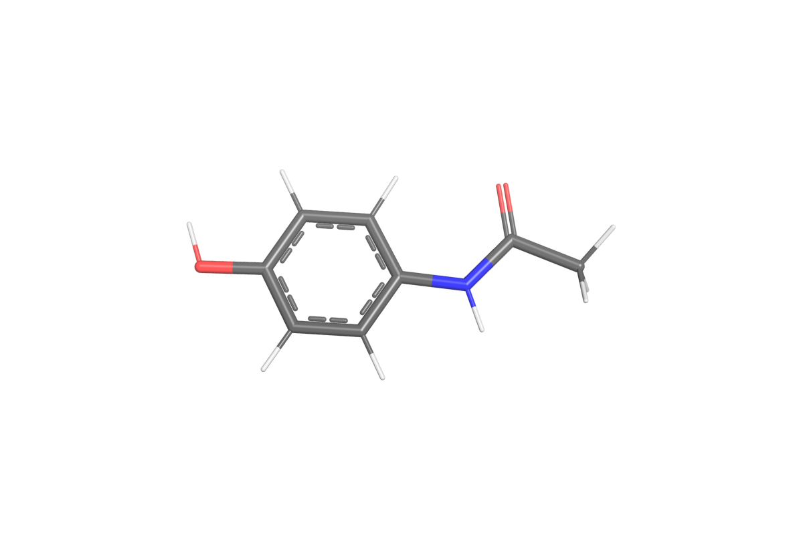

# Paracetamol

**Tested against md-tools `0.5.4`.** A single small molecule in water: 20 atoms, one rotatable
amide, one ring. The system to use when the question is about a LIGAND rather than about a protein.



*Paracetamol (acetaminophen), embedded and minimised from its SMILES.*

## Why this system

A ligand needs parameters before it can be simulated, and paracetamol is small enough that
parameterising it takes about a minute — so it is the system where the parameter package, its
identity and its reuse can be shown end to end without waiting.

## Build it

Unlike a protein, a small molecule has no library of residue templates, so the first step produces
a **parameter package** of its own:

```bash
md-openmm build-top --parameterize -i paracetamol.sdf --config para.config \
    -op build/parameter/TYL.pdb -os build/parameter/TYL.xml \
    -log build/parameterize.log --resname TYL
```

`-i` reads a `.sdf`, a `.mol2` or a `.smi`. A `.smi` states the chemistry and no coordinates, so a
conformer is embedded; a structure without bond orders, such as a `.pdb`, is refused, because
parameterisation needs the molecular graph.

**Then the box, reusing that package rather than parameterising again.** `build.config`:

```yaml
solute:
  kind: ligand
  parameters: ./build/parameter     # a PATH, relative to this file
solvent:
  model: TIP3P
  padding_nm: 1.0
```

```bash
md-openmm build-top -i build/parameter/TYL.sdf --config build.config \
    -os build/built.xml -op build/built.pdb -log build/built.log
```

That writes the three files every method on this page starts from: the serialised System, the
structure it matches, and the build record. `built.log` says `reused (stated reference)` rather
than `created` — the minute of charge generation happened once, above, and no later build of this
molecule repeats it.

`parameters` takes a path, as here, so nothing has to be registered and no catalog has to exist.
Give `<compound-id>/<parameter-id>` instead to take a package from the catalog by name, `search`
(the default) to find one whose recorded criteria match this build, or `generate` to parameterise
regardless of what the catalog holds.

**Implicit solvent** replaces the `solvent` block and produces no box at all:

```yaml
solvent:
  model: GBn2
```

The package is identified by its chemical state and its parameters, not by the conformer it was
made from, so the same molecule from a different pose resolves to the same package.

## Where to go next

| method | what it is for | |
|---|---|---|
| [**cMD**](cMD.md) | parameterise once, then a plain simulation from that package | published |
| [**REST2**](REST2.md) | solute tempering of the molecule itself | published |
| [**AIS**](AIS.md) | annealed importance sampling, with torsion reweighting | published |
| **Umbrella sampling** | a potential of mean force along a chosen torsion | planned, 0.6.2 |
| **Alchemical (TI, FEP)** | hydration free energy | planned, 0.7.0 |

*Umbrella sampling arrives in 0.6.2 and the alchemical pages in 0.7.0. They are listed here so the
shape of the set is visible; neither is written yet, and neither is linked to a page that does not
exist.*
