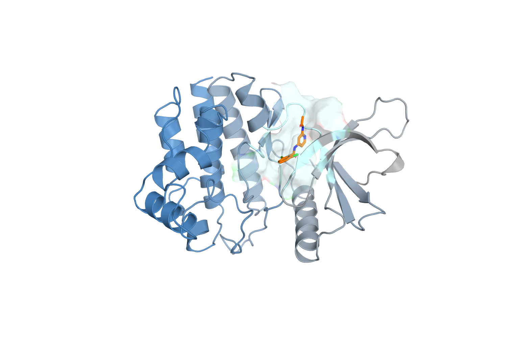
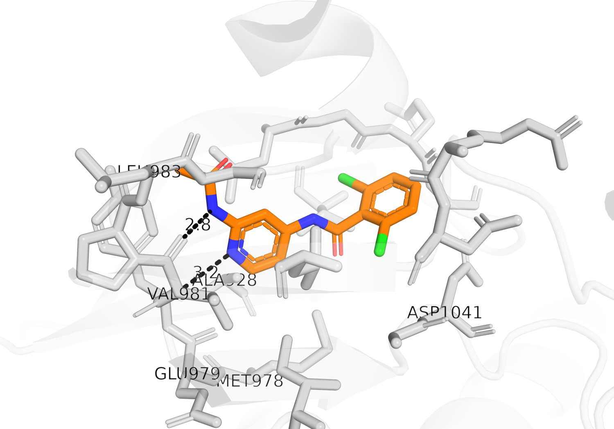

# A protein–ligand complex, end to end

**Tested against md-tools `0.6.1`.** The structures, figures and numbers are from the prepared
TYK2 fixture and its build records. The parameterisation and complex-build commands below are the
recorded preparation of that fixture, with its `ligand_catalog` path adapted for a standalone
working directory; they have not been re-executed for this page.

These pages all use one system, prepared once. Preparing a protein separately for each method is
how four methods end up studying four slightly different proteins.

## The system: TYK2 with `ejm_31`

**TYK2** is a non-receptor tyrosine kinase of the JAK family, and the structure here is its kinase
domain — the two-lobed fold every protein kinase shares, with the ligand bound in the cleft between
the lobes where ATP normally sits.



*The prepared complex: 4,670 protein atoms in one chain, the ligand in orange, and the residues within 5 Å of it shown as a translucent surface. Rendered from `prepared/complex_ejm_31.pdb`.*

**`ejm_31`** is a small neutral inhibitor — 32 atoms, an amide linking a dichlorophenyl ring to a
pyridine — from a congeneric series of sixteen with measured affinities. Its experimental binding
free energy is **−9.54 kcal/mol**.

Zoomed into the site, the reason it binds where it does is visible: the ligand makes the two
**hinge hydrogen bonds** that almost every ATP-competitive kinase inhibitor makes, to the backbone
of the residues joining the two lobes.



*The ligand (orange) against the residues within 4.5 Å (grey), hydrogens hidden. The dashed lines are the two hinge hydrogen bonds, 2.8 Å and 3.2 Å in the prepared structure. Distances are measured from the coordinates, not drawn by hand.*

That pocket is why this system is used to demonstrate **selective REST2**: the interesting degrees
of freedom — the ligand's own torsions, and the sidechains lining the site — are a few hundred
atoms out of 53,030, and heating only those is the whole point of choosing a hot region.

## Where the inputs come from

The protein and the ligands are from
[OpenFreeEnergy/openfe-benchmarks](https://github.com/OpenFreeEnergy/openfe-benchmarks),
`openfe_benchmarks/data/benchmark_systems/jacs_set/tyk2/` — MIT licensed, Copyright (c) 2022
Irfan Alibay. Four files matter:

```text
protein.pdb                      the kinase domain, ACE/NME capped
ligands.sdf                      sixteen congeneric ligands with bond orders
experimental_binding_data.json   the measured affinities
PREPARATION_DETAILS.md           what upstream did to the structure, and why
```

```bash
git clone https://github.com/OpenFreeEnergy/openfe-benchmarks
cd openfe-benchmarks/openfe_benchmarks/data/benchmark_systems/jacs_set/tyk2
```

Extract the one ligand you want from the multi-molecule SDF — the bond orders in that file are what
parameterisation needs, and a PDB cannot supply them:

```python
from rdkit import Chem

supplier = Chem.SDMolSupplier("ligands.sdf", removeHs=False)
ejm_31 = next(m for m in supplier if m.GetProp("_Name") == "ejm_31")
Chem.MolToMolFile(ejm_31, "ejm_31.sdf")
```

## 1. Build the ligand parameters, once

A ligand needs its own parameters before it can appear in any simulation, and MD-tools makes that a
separate step with its own output: a **parameter package**, created once and reused in every
environment — complex, solvent box, vacuum — so that every leg of every later calculation uses the
identical intramolecular Hamiltonian.

```bash
md-openmm build-top --parameterize -i ejm_31.sdf --config para.config \
    -op build/parameter/L31.pdb -os build/parameter/L31.xml \
    -log build/parameterize.log --resname L31
```

`para.config` states the small-molecule force field and the charge method:

```yaml
# para.config
parameters:
  small_molecule_forcefield: openff-2.2.1   # SMIRNOFF
  charge_method: am1bcc                     # AmberTools sqm
```

The package records both, and the implementation that produced the charges
(`backend_id: ambertools-sqm`), so a later build can tell whether a package it found was made the
same way it would make one.

AM1-BCC through AmberTools `sqm` takes about 70 seconds for a ligand this size. The package that
comes out is identified by its **chemical state and its parameters, not by its conformer** — the
same molecule from a different pose produces the same package id.

!!! tip "Give the package aliases before you register it"
    `solute.aliases` defaults to empty and registration is **write-once**. A package registered
    without aliases can only ever be found by its compound id, never by the name you think of it
    by, and that cannot be corrected afterwards. See [ligand packages](../../ligand-packages.md).

## 2. Build the complex

With the package in hand, the complex build reuses it rather than re-parameterising:

```yaml
# complex.config -- the fixture's own build configuration
solute:
  kind: complex
ligands:
  - select: {chain: B, resid: "1"}
    parameters: LOCAL-DKNAYSZNMZIMIZ/param_bd1388e5fe3e
ligand_catalog:
  path: ./packages          # where the package from step 1 lives
forcefield:
  protein: ff14SB
solvent:
  model: TIP3P
  padding_nm: 1.2
  box_shape: cube
  cutoff_nm: 0.9
constraints:
  type: HBonds
  rigid_water: true
```

```bash
md-openmm build-top -i complex_ejm_31.pdb --config complex.config \
    -os build/built.xml -op build/built.pdb -log build/built.log
```

Built this way the system is **53,030 particles**, 16,462 residues, ff14SB and TIP3P in a 1.2 nm
cubic box. Everything downstream — plain MD, selective REST2, and later the alchemical methods —
starts from exactly these files.

!!! note "Why ff14SB and TIP3P rather than ff19SB and OPC"
    OPC applies its own rounded 1-4 electrostatic scale to every pair, the ligand's included, while
    a vacuum build applies the package's exact value. Alchemical cycles pair a solvated leg with a
    vacuum leg and refuse that mismatch, so the choice is made here, once, for every method that
    will use this system.

## Where to go next

| method | what it is for | |
|---|---|---|
| [**Selective REST2**](REST2.md) | choosing the hot region: the ligand alone, or the ligand plus the sidechains lining the pocket | published, `0.6.1` |
| **cMD** | a long unbiased simulation of the same complex, as the reference every enhanced method is compared against | in preparation — a 1 µs run is in progress, and the page follows it |
| **Umbrella sampling** | a potential of mean force along the ligand–protein centre-of-mass distance | planned, 0.6.2 |
| **Alchemical (TI, FEP)** | absolute and relative binding free energies on this complex | planned, 0.7.0 |

*Umbrella sampling arrives in 0.6.2 and the alchemical pages in 0.7.0. They are listed here so the
shape of the set is visible; neither is written yet, and neither is linked to a page that does not
exist.*

The cMD page is written when its run finishes, not before: like every page here, its numbers are
copied from the files a real run produced.
